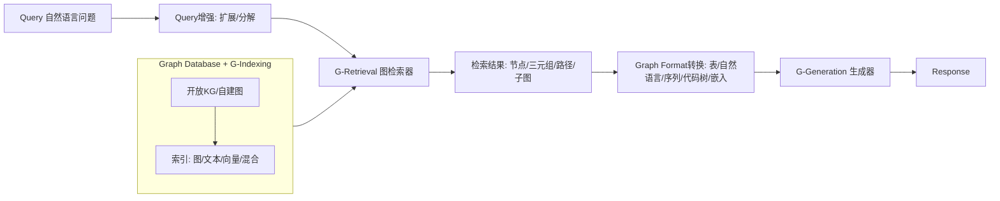
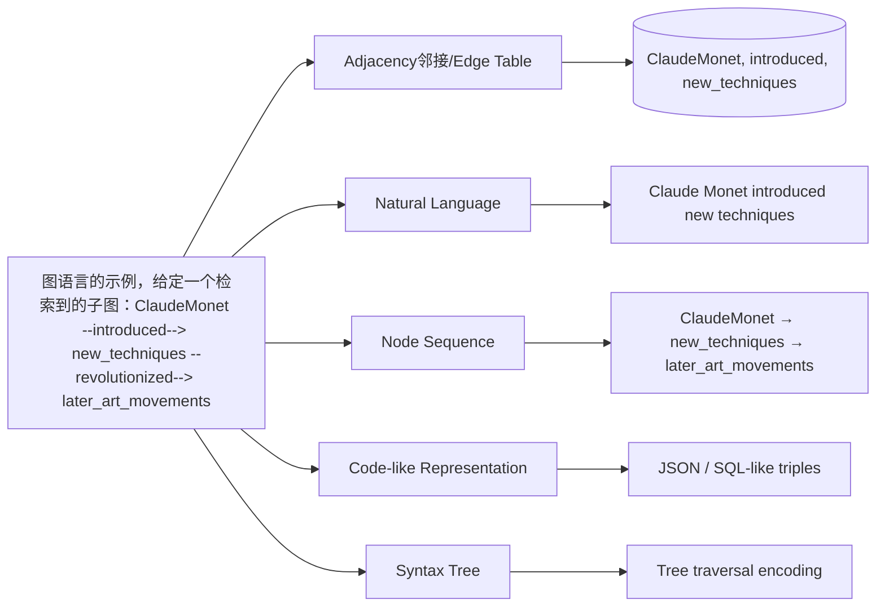
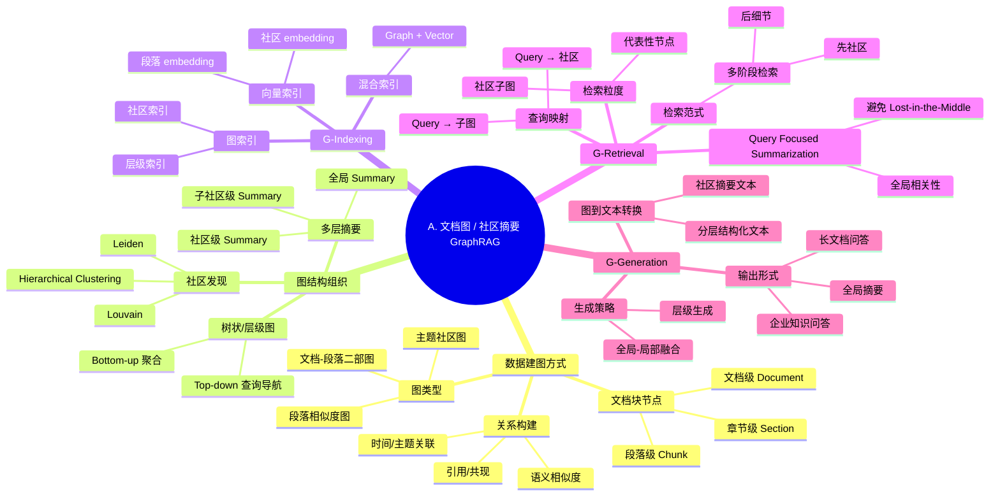
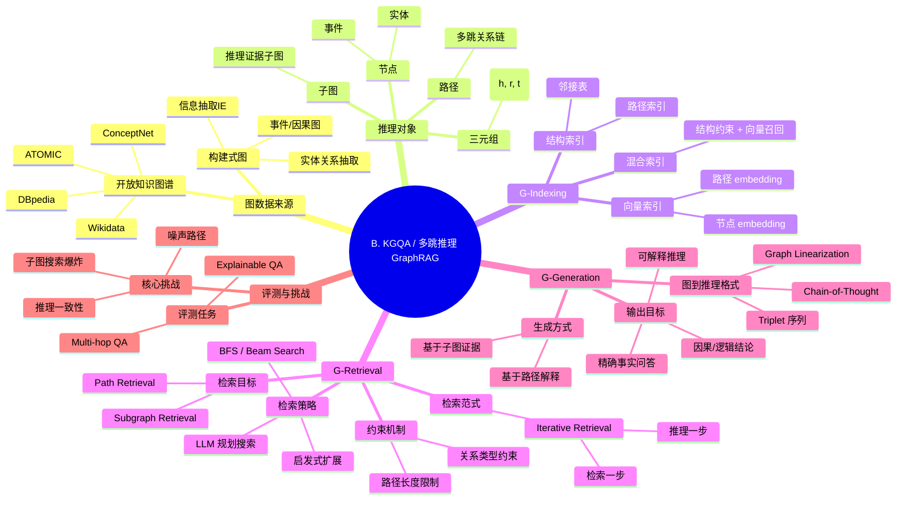

### [Graph retrieval-augmented generation: A survey](https://dl.acm.org/doi/abs/10.1145/3777378)

[被引用次数：347](https://scholar.google.com/scholar?cites=9398758468741961315&as_sdt=80005&sciodt=0,11&hl=zh-CN)

 Peking University 

Zhejiang University

Peng B, Zhu Y, Liu Y, et al. Graph retrieval-augmented generation: A survey[J]. ACM Transactions on Information Systems, 2024.

## 1) 读懂《Graph Retrieval-Augmented Generation: A Survey》前需要掌握哪些基础知识？

### 1.1 先把“GraphRAG 为啥出现”搞明白

论文在引言里说：传统 RAG 的主要问题在于 **忽略关系（relational knowledge）**、**上下文冗长导致“lost in the middle”**、以及 **难以获得全局信息（例如 QFS）**，GraphRAG 用“图结构”来补这些短板。

你要具备的“地基”是：

- **RAG 最小流程**：检索文本片段→拼进 prompt→生成答案
- **图能表达什么**：实体（节点）+ 关系（边）+ 路径/子图（多跳关系）
- **为什么图更适合关系型问题**：关系被显式表示，不用让 LLM 从一堆自然语言里“猜”关系（见 Fig.1 对比）。

### 1.2 图数据的基本表示：Text-Attributed Graph (TAG)

论文把 GraphRAG 中使用的图统一成 **TAG：节点/边都带文本属性**（非常关键，因为它解释了“图”和“语言模型”怎么接上）。
TAG 直觉理解：

- 节点：实体/段落/事件/文档块（都有文本描述）
- 边：关系（同样可能有文本描述，比如 “cites/causes/located_in”）

### 1.3 检索为什么变难：候选子图爆炸 + 相似度难定义

GraphRAG 检索不是找 Top-k 文段，而是找 **节点/三元组/路径/子图**。论文明确指出两大挑战：

- **候选子图数量随图规模指数增长**（需要启发式或分阶段策略）
- **“文本 query vs 图结构”相似度**更难：要同时懂语义和结构（见检索架构图 Fig.4）。

### 1.4 GNN 与 LM 的最基本概念（够用即可）

你不需要成为 GNN 专家，但要知道：

- **GNN**会做“消息传递（message passing）”，把邻居信息聚合到节点表示里（论文在 preliminaries 给了公式）。
- **LM/LLM**是生成器或检索器：能做 query 理解、路径规划、甚至当 agent 调工具（论文在检索与生成章节反复出现 LM-based / GNN-based / hybrid）。

------

## 2) 用中文通熟易懂地解读论文（抓关键）

这篇综述的“主线”非常清晰：把 GraphRAG 拆成 **三阶段**：
**G-Indexing（建图与建索引）→ G-Retrieval（图引导检索）→ G-Generation（图增强生成）**，并给了总览 Fig.2。

我用一个简化流程图把 Fig.2 的意思画出来：

### 2.1 Fig.1：GraphRAG 相对 RAG 的直观优势是什么？

Fig.1 用一个“艺术史影响关系”的问题说明：

- 直接问 LLM：容易“泛泛而谈”或不够具体
- RAG：能找相关文本，但很难突出题目真正关心的关系（例如“influence”）
- GraphRAG：把关系显式成三元组/图元素，检索到的就是“谁影响谁、怎么影响”，因此更精准。

### 2.2 三阶段里每个阶段“到底在解决什么问题？”

#### (A) G-Indexing：先把知识组织成“可检索的图”

论文把图来源分两类：

- **Open Knowledge Graphs**：Wikidata/DBpedia/ConceptNet/ATOMIC 等（省时间、但可能不贴合你私域数据）
- **Self-Constructed Graph Data**：从你自己的文档/表格/系统日志/客服工单里抽实体与关系来建图（更贴业务）

然后是索引方式（Fig.3 概览）：

- **图索引**：保留结构，便于 BFS/最短路等图搜索
- **文本索引**：把图转成文本再用传统检索
- **向量索引**：把节点/子图编码成 embedding 做 ANN 检索
- **混合索引**：综合使用，实际工业更常见（Fig.3 的“overview of graph-based indexing”）。

#### (B) G-Retrieval：从图里“取什么”以及“怎么取”

论文把检索设计拆成 4 块（Fig.4 架构一眼看懂）：

1. **Retriever 类型**：非参数（规则/图算法）、LM-based、GNN-based，或者多阶段混用（效率 vs 精度权衡）
2. **Retrieval Paradigm（范式）**：
   - once（一次取完）
   - iterative（迭代取，可能自适应停止）
   - multi-stage（多阶段：先粗后精）
3. **Granularity（粒度）**：取节点/三元组/路径/子图/混合（粒度越大信息越全，但越贵、越容易带噪）
4. **Enhancement（增强）**：
   - Query 增强：扩展、分解
   - Knowledge 增强：合并（压缩聚合）、剪枝（去噪）

你可以把 Fig.4 理解成：“GraphRAG 的研究主要都在这四个旋钮上做文章”。

#### (C) G-Generation：把“图结果”喂给生成器之前必须做格式转换

这部分是 GraphRAG 和文本 RAG 最大的工程差异：**图不能直接塞进 LLM**，必须转成 LLM 能读的形式。Fig.2 也强调了这一点：GraphRAG 需要把检索到的图信息转成 generator 可接受的 pattern。

论文用 Fig.5 总览生成阶段，并用 Fig.6 具体举例“图语言/图格式怎么转”：把同一个子图转成

- 邻接/边表
- 自然语言描述
- 节点序列
- 代码样式
- 语法树
  以及图嵌入（embedding）。

你可以把它类比成：

> RAG 是 “把证据文本粘贴进去”，
> GraphRAG 是 “把结构化证据翻译成 LLM 会读的语言”。

------

## 3) 重要术语提取与通俗解释（配合图表理解）

### 3.1 核心框架与对象

- **GraphRAG（Graph Retrieval-Augmented Generation）**：从图数据库里检索“带关系的知识”（节点/边/路径/子图）来增强生成。相比 RAG 更强调结构信息。
- **TAG（Text-Attributed Graph）**：节点与边都带文本属性的图，是 GraphRAG 的统一数据格式。
- **Graph elements（图元素）**：GraphRAG 的“证据单位”，可以是 nodes / triplets / paths / subgraphs（见 Fig.2 的检索结果类型）。
- **Subgraph（子图）**：从大图里截取的局部结构；通常用于多跳推理、全局摘要等，但候选空间巨大（指数爆炸）。

### 3.2 三阶段术语

- **G-Indexing（Graph-Based Indexing）**：建图+建索引，决定后续检索“能快到什么程度、能取到什么粒度”。
- **G-Retrieval（Graph-Guided Retrieval）**：给定 query，从图里找最相关的图元素/子图（论文用相似度最大化来形式化）。
- **G-Generation（Graph-Enhanced Generation）**：把检索到的图信息转成生成器能处理的输入并生成答案。

### 3.3 索引与检索相关

- **Graph/Text/Vector/Hybrid Indexing**：分别对应“保结构的图索引 / 把图翻译成文本检索 / embedding 向量检索 / 混合”。（Fig.3 概览）
- **Retrieval granularity（检索粒度）**：节点、三元组、路径、子图、混合（见 Fig.4 的“Retrieval Granularity”总结）。
- **Once / Iterative / Multi-stage retrieval（一次/迭代/多阶段检索）**：
  - 一次：快，但可能不够深
  - 迭代：逐步扩展/修正，更准但更慢
  - 多阶段：先快后准，常用于工业

### 3.4 生成阶段：Graph formats / Graph languages

- **Graph formats（图格式）**：把图“翻译成 LLM 能读的形式”的总称。
- **Graph languages（图语言）**：论文总结的图语言形式，包括 adjacency/edge table、自然语言、代码样式、语法树、节点序列（Fig.6）。

我用 Fig.6 的意思画个“同一子图的五种表达”：图语言的示例。给定左侧检索到的子图，我们展示了如何将其转换为邻接/边表、自然语言、节点序列、类似代码的形式和语法树，以适应不同生成器的输入形式要求。

### 3.5 评测与基准（你读 survey 很容易跳过，但其实很重要）

论文把评测分两类：

- **下游任务指标（生成质量）**：EM/F1、Accuracy、BLEU/ROUGE/METEOR 等；也提到 BERT4Score、GPT4Score 用于缓解“同义但不完全匹配”。
- **检索质量指标（retrieval quality）**：直接评估“取回来的图证据是否准”（但更难做）。
  并列举专门面向 GraphRAG 的 benchmark：STARK、GraphQA、GRBENCH、CRAG 等。

------

## (A) 文档图 / 社区摘要方向

### —— GraphRAG / QFS / 企业知识库 / 长文档全局理解

> 关键词：**Document Graph · Community · Global Summary · Hierarchical Compression**
> 典型代表：**Microsoft GraphRAG、QFS、Long-Doc QA**

------

### 1️⃣ 这条线在解决什么核心问题？

- **不是“多跳推理对不对”**

- 而是：

  > *当文档规模大到上下文放不下时，
  > 如何仍然让 LLM 抓住“全局结构与重点”？*

这正是 **微软 GraphRAG / QFS** 的核心动机。

------

### 2️⃣ 这条线的“技术关键词”其实不是 KG

你会发现，这一页里几乎 **不强调路径搜索、最短路、逻辑推理**，而是：

- 社区（Community）
- 聚合（Aggregation）
- 压缩（Compression）
- 层级（Hierarchy）

👉 **这是“信息组织问题”，不是“逻辑推理问题”**

------

# 

## (B) KGQA / 多跳推理方向

### —— 路径 / 子图检索 / 逻辑与因果推理

> 关键词：**Knowledge Graph · Multi-hop · Path · Subgraph · Reasoning**
> 典型代表：**KGQA、GraphQA、STaRK、CRAG**

------

### 1️⃣ 这条线的本质是“推理搜索问题”

和 (A) 完全不同，这里核心是：

> **在巨大的图空间中，
> 找到“对回答有用的那一小段结构”。**

所以你会看到大量关键词是：

- BFS / Beam
- Path / Subgraph
- Iterative
- Constraint

------

### 2️⃣ LLM 在这里的角色 ≠ 生成器

在 (B) 里，LLM 更多扮演的是：

- **搜索规划器（planner）**
- **路径评分器（scorer）**
- **推理解释器（explainer）**

👉 而不是“长文档总结器”

------

### 3️⃣ 研究中“难但硬核”的点

- **路径级 vs 子图级检索的理论比较**
- **LLM-guided search 是否真的优于图算法**
- **如何定义“最小充分证据子图”**
- **结构正确但语义错误的推理陷阱**

> 👉 非常适合：**因果推理 / 法律 / 医疗 / 科学知识推理**

| 维度       | (A) 文档图 / 社区摘要 | (B) KGQA / 多跳推理 |
| ---------- | --------------------- | ------------------- |
| 核心难点   | 信息压缩与组织        | 结构搜索与推理      |
| 图角色     | 组织结构              | 推理空间            |
| LLM 角色   | 总结与融合            | 搜索规划与解释      |
| 工程成熟度 | ⭐⭐⭐⭐（已工业化）      | ⭐⭐–⭐⭐⭐              |

------

