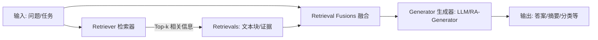
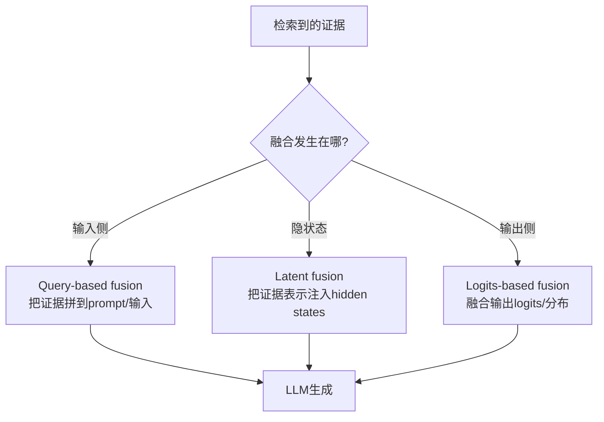

### [Retrieval-augmented generation for natural language processing: A survey](https://arxiv.org/abs/2407.13193)

[被引用次数：132](https://scholar.google.com/scholar?cites=10896765674585930153&as_sdt=80005&sciodt=0,11&hl=zh-CN)

Wu S, Xiong Y, Cui Y, et al. Retrieval-augmented generation for natural language processing: A survey[J]. arXiv preprint arXiv:2407.13193, 2024.

City University of Hong Kong McGill University, Mila

## 1）读懂这篇 Survey 需要的基础知识（通俗版）

### 1.1 先把 RAG 的“3 大模块”想清楚

论文把 RAG 直接抽象成 **Retriever（检索器） + Generator（生成器） + Retrieval Fusions（融合）** 三块，并给了总览图 Figure 1。

你需要提前熟悉：

- **检索器 Retriever**：把输入（问题/上下文）编码成向量，在索引里近似最近邻搜索，从“外部知识库/数据存储”里拿回相关片段。论文强调核心矛盾是 **效率 vs 质量**（检索快但不准 / 准但慢）。
- **融合 Retrieval Fusions**：怎么把“检索到的内容”喂给大模型。论文把融合分成三类：**Query-based / Latent / Logits-based**。
- **生成器 Generator**：大语言模型本体（GPT/Mistral/Gemini 等）或“带检索模块的生成器”（如 RETRO 这类）。

用一张 Mermaid 总览图把 Figure 1 的逻辑复刻出来（你可直接复制到 Typora）：

------

### 1.2 信息检索（IR）与向量检索的基础

你至少要知道这些“检索积木”在做什么：

- **Embedding / 向量表示**：把文本变成向量，方便算相似度（如 cosine）。论文在“检索质量”讨论里明确提到：选什么 key、选什么 embedding 模型，会强烈影响检索效果。
- **ANN（Approximate Nearest Neighbor）近似最近邻**：为了快，用近似算法（例如 HNSW、PQ 等）做召回。论文把 ANN 算法视为“效率-质量权衡”的关键点。
- **Datastore（外部知识库）**：通常是 key-value 形式：key 是向量（embedding），value 是文本块/结构化信息。论文在总览里直接这么定义。

------

### 1.3 Transformer/LLM 的最低限度理解

不需要你会推公式，但要知道：

- LLM 生成的基本机制是 **逐 token 预测 logits**
- 因此才会出现论文里的 **logits-based fusion**（在“输出分布/打分层”融合检索信息，而不是只拼 prompt）
- 以及 **latent fusion**（在“隐状态/中间表示”融合检索表示）

------

### 1.4 训练与微调（尤其是“是否更新知识库”）

论文把 RAG 训练分成两大类，并用 Figure 4 画得很清楚：

- **不更新 datastore**：只训练检索器/生成器/联合训练，知识库不变。
- **更新 datastore**：先把新语料插入/更新到 datastore，再训练生成器等模块。

你还需要知道 **PEFT**（参数高效微调）大概是啥，比如 LoRA；论文在训练生成器部分提到它能降低 LLM 微调成本。

------

## 2）用中文通俗解读这篇 Survey（抓关键内容）

### 2.1 这篇 Survey 的“主线叙事”

它不是按“应用”讲，而是按 **RAG 系统工程的关键环节**讲清楚：

- RAG 是三模块系统（Figure 1）
- 融合方式三分法：Query-based / Latent / Logits-based（Figure 1 旁的定义段落）
- 训练方式两分法：是否更新 datastore（Figure 4）
- 最后讨论挑战：检索质量、效率等（Section 9）

------

### 2.2 最关键的“融合三分法”——你可以用它快速读完大量方法

你读任何 RAG 论文，都可以先问一句：**它到底在融合哪一层？**

这正对应论文的定义：

- Query-based：增强输入后再喂生成器
- Logits-based：在输出 logits 层融合检索信息
- Latent：在生成器的 latent/hidden states 注入检索表示

------

### 2.3 RAG 的“工程第一性矛盾”：检索质量 vs 检索效率

论文在 Retriever 的总览里直接点出：检索器的主要挑战是 **在效率与质量之间找最优 trade-off**。
在讨论部分又把“提升检索质量”的设计因素拆成 4 个方向：

- 选什么 key（怎么把任务转成可检索的键）
- 选什么 embedding 模型（通用/领域/微调）
- 选什么相似度度量（cosine、欧氏、更复杂的）
- 选什么 ANN 算法（HNSW、PQ 等）并权衡速度与精度

------

### 2.4 训练策略（Figure 4）对“系统能力边界”影响很大

Figure 4 的核心含义可以用一句话概括：

- **知识库不变**：你在“学怎么用知识”
- **知识库可更新**：你在“学 + 持续吸收新知识”

论文明确把训练分为这两类，并给出训练检索器 / 训练生成器 / 联合训练，以及“先更新知识库再训练生成器”等路径。

------

### 2.5 生态与落地：LangChain / LlamaIndex

论文把 LangChain 与 LlamaIndex作为“框架层”的代表，强调它们的作用是把检索系统与 LLM 连接起来，让外部数据能更顺滑地进生成流程。

------

## 3）重要术语提取与通俗解释（带“放在哪个模块”）

> 你可以把下面当作读论文/做读书卡的“术语清单”。

### 系统结构类

- **Retriever（检索器）**：由 encoder（编码器）+ indexing（索引）+ datastore（知识库）组成。
- **Datastore（外部知识库）**：存外部知识，常见是 key-value（key=embedding，value=文本块/信息）。
- **Generator（生成器）**：LLM 本体或“检索增强生成器（RA generator）”。论文举例 RA generator 有 RETRO、Enc-Dec 等。
- **Retrieval Fusions（检索融合）**：把 retrievals 用三类方式注入生成流程：query/latent/logits。

### 检索与索引类

- **Embedding model（向量模型）**：把文本变向量；论文提到可用 BERT/RoBERTa 或领域 embedding，并可做领域适配以提升检索质量。
- **Similarity metric（相似度度量）**：cosine、欧氏等，用于排序/筛选检索结果。
- **ANN（Approximate Nearest Neighbor）**：为了加速检索的近似搜索；论文举例 PQ、HNSW，并强调其带来效率-质量权衡。

### 融合策略类（三分法）

- **Query-based fusion**：先把证据拼进输入 prompt，再生成。
- **Latent fusion**：把检索表示注入 LLM 的 hidden states（更像“内部加插件”）。
- **Logits-based fusion**：在输出 logits/概率分布层融合检索信号（更像“输出端纠偏/集成”）。

### 训练与更新类（Figure 4）

- **RAG without datastore update**：知识库不变，只更新模块参数（训检索器/训生成器/联合训）。
- **RAG with datastore update**：先更新/插入新语料到 datastore，再训练生成器等。
- **LoRA（PEFT）**：论文在训练生成器时提到它是降低 LLM 微调成本的一类方法。

### 挑战类（Section 9）

- **Retrieval Quality（检索质量）**：要提升“相关性”，涉及 key 设计、embedding 选择、相似度度量、ANN 算法选择等。
- **RAG Efficiency（效率）**：限制了能取回多少、系统能跑多快；论文指出简单做法是减少检索量或堆算力，但都有代价。

------

