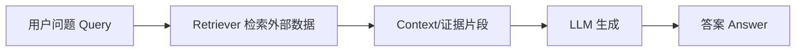
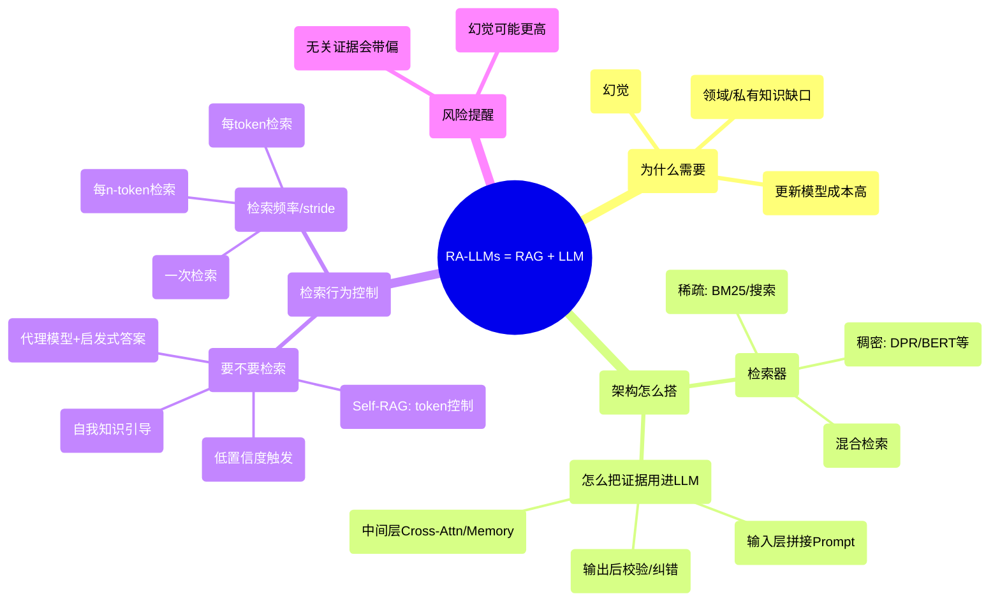

### [A survey on rag meeting llms: Towards retrieval-augmented large language models](https://dl.acm.org/doi/abs/10.1145/3637528.3671470)

 [被引用次数：999](https://scholar.google.com/scholar?cites=4439195171371337250&as_sdt=80005&sciodt=0,11&hl=zh-CN)

Fan W, Ding Y, Ning L, et al. A survey on rag meeting llms: Towards retrieval-augmented large language models[C]//Proceedings of the 30th ACM SIGKDD conference on knowledge discovery and data mining. 2024: 6491-6501.

The Hong Kong Polytechnic University, HK SAR 

National University of Singapore, Singapore

这篇 survey 把“RAG + LLM”称为 **RA-LLMs**，并按**架构 / 训练策略 / 应用**三条主线梳理。

论文在引言里明确动机：LLM 仍有**领域知识缺口、幻觉、更新成本高**等限制，因此需要借助 RAG <u>引入外部可靠知识</u>来增强能力。

------

## 1）读懂这篇论文需要哪些基础知识（通俗版）

### A. 先理解“RAG/RA-LLM”最基本流水线

你需要知道：**检索（Retriever）**先从外部库找资料，**生成（Generator/LLM）**再用这些资料来回答。

这篇 survey 强调：RAG 能带来“更及时、更可控、可解释、能减少幻觉”的潜力。

------

### B. 你要懂“检索”里面三件事：表示、索引、排序

1. **表示/Embedding**：把文本变成向量，便于相似度搜索。
2. **索引/ANN**：大规模近邻搜索（速度 vs 准确率权衡）。
3. **重排序/过滤**：先粗搜 top-k，再做更准的 rerank / 纠错。

（这些在很多 RAG 系统里是默认模块；这篇 survey 在 Table 1 里也用“检索器类型 + 是否训练检索器”等字段来对比经典模型。）

------

### C. 你要理解“怎么把检索结果喂给 LLM”：三种融合位置

这篇 survey 讲得很清楚：把检索到的信息融合进生成器有不同“插入点”：

- **输入层融合**：把证据拼到 prompt 里（最常见，也最容易落地）
- **输出/后融合**：生成后再校验、引用、纠错
- **中间层融合**：在 Transformer 的中间层做 cross-attention / memory 注入（更强，但需要改模型内部，不适合只能用 API 的闭源 LLM）

------

### D. 你要懂两个“行为控制”概念：何时检索 + 多频繁检索

论文专门一节讲 **Retrieval Necessity & Frequency**：

- **Necessity（是否需要检索）**：检索不是越多越好；无关证据会覆盖 LLM 已有正确知识，甚至让幻觉翻倍。
- **Frequency/Stride（检索频率）**：常见三档：一次检索 / 每 n 个 token 检索 / 每 token 检索。

------

## 2）用中文通俗解读这篇 survey（抓住关键内容）

### 2.1 论文到底在综述什么

它把“RAG + LLM”系统化为 **RA-LLMs**，从三条主线总结：

- **架构（architectures）**：检索器、生成器、增强/融合方式
- **训练策略（training strategies）**：怎么训检索器/生成器/两者协同（以及更贴近 LLM 的训练范式）
- **应用（applications）**：哪些任务最受益（需要最新、可靠、可追溯知识的场景）

------

### 2.2 一个“总览表”抓住方法谱系：Table 1

论文用 **Table 1** 汇总了一批高影响 RAG/RA-LLM 工作（如 REALM、RAG、FiD、RETRO、Atlas、FLARE、Self-RAG 等），并用字段对齐它们的关键设计：

- 时间、模型、引用
- 检索器类型（稀疏/稠密/搜索引擎等）
- 是否训练检索器（RetTrain）
- 检索增强细节（如 query rewriting / reranking / 频率策略等）
- 生成器与增强融合位置、评测任务类型
  （你读 Table 1 的方式：**先看“检索器 + 是否训练”，再看“增强/融合发生在哪一层”，最后看“评测任务”来理解它解决的痛点**。）

------

### 2.3 论文最想提醒你的“坑”：检索可能害你

这篇 survey 很强调一个常被忽视的点：**检索不是万能药**。
<u>如果检索到的段落不相关，LLM 反而更容易被“带偏”，甚至幻觉更严重。所以研究重点之一变成：**如何判断要不要检索、检索哪些、怎么用**。</u>

这也直接引出代表方法：

- **Self-RAG**：用特殊 token 让模型自我判断是否需要检索并控制检索行为。
- **FLARE**：当模型 logits 置信度低于阈值时触发检索（动态触发）。
- **SKR**：用“自我知识”作为参考，指导是否检索与如何检索。
- **SlimPLM**：用小代理模型生成“启发式答案”，用来判断缺什么知识并辅助 query rewriting。

------

### 2.4 把“关键方法谱系”串起来

------

## 3）论文重要术语提取 + 通俗解释（带着你读 Table 1/相关段落）

> 我选的是这篇 survey 里“最承重”的术语（读 Table 1 和检索控制那节会反复遇到）。

### 3.1 RA-LLMs（Retrieval-Augmented Large Language Models）

把 LLM 的生成过程与外部检索结合：回答不只靠“模型记忆”，而是靠“**检索到的证据 + LLM 组织表达**”。

### 3.2 Retrieval Necessity（检索必要性）

核心问题：**这道题到底需不需要查资料**？
因为“查到不相关内容”会覆盖 LLM 原本正确知识，导致更糟答案。

### 3.3 Retrieval Frequency / Retrieval Stride（检索频率/步长）

决定检索发生的节奏：

- One-time（只查一次）
- Every-n-token（写一段再查）
- Every-token（几乎边写边查，最贵但可能更强）

### 3.4 Intermediate-layer Integration（中间层融合）

不是把证据拼到 prompt，而是把检索到的向量/块在 Transformer 中间层用 cross-attention / memory 注入（如 RETRO 的 Chunked Cross Attention）。优点是能更频繁、更高效处理大量 chunk；缺点是需要改模型内部，闭源 API 很难做。

### 3.5 Table 1（高影响模型对照表）

这张表是你快速“扫谱系”的入口：用统一字段对齐各 RAG/RA-LLM 的检索器、训练方式、增强方式与评测任务。

------

