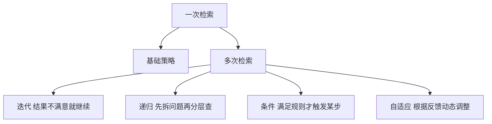

### [A survey on retrieval-augmented text generation for large language models](https://arxiv.org/abs/2404.10981)

 [被引用次数：177](https://scholar.google.com/scholar?cites=17937476802935747072&as_sdt=80005&sciodt=0,11&hl=zh-CN)

Huang Y, Huang J. A survey on retrieval-augmented text generation for large language models[J]. arXiv preprint arXiv:2404.10981, 2024.

YorkUniversity,Canada

------

## 1) 读懂这篇综述前，需要掌握哪些基础知识

### A. 你得先懂：LLM 为什么会“胡说”

论文在引言里强调：LLM 训练后“知识是静态的”，因此遇到训练数据之外的新信息就容易编造（hallucination），RAG 用检索外部信息来缓解这个问题（Fig.1 展示了“超出训练范围的问题，RAG 能拉回正确答案”的直观例子）。

你要掌握的点：

- **训练截止**：模型不知道训练之后发生的事
- **幻觉**：回答听起来很像真的，但可能是错的
- **外部知识注入**：把“检索到的材料”作为证据喂给模型

### B. 你得先懂：信息检索（IR）的最小必备

论文在“Retrieval”部分把传统与神经检索对比得很清楚：

- **稀疏检索**（BM25 等）看关键词匹配
- **稠密检索**（BERT/Embedding）看语义相似度（向量距离）

最小必备概念：

- **Index（索引）**：把知识库整理成“可被快速查”的结构
- **Embedding（向量表示）**：把句子/段落变成向量
- **Top-K**：取最相关的 K 条材料
- **Ranking / Re-ranking**：先粗排、再精排

### C. 你得先懂：RAG 的“流水线”长什么样

论文把 RAG 统一成一个基础工作流（Fig.2）：先建索引→检索→生成。

用 Mermaid 画成最简版（避免括号等符号，保证不报错）：

### D. 你得先懂：为什么 RAG 被拆成“四阶段”

这篇综述的核心贡献之一，是从检索视角把 RAG 划分为四段：
**Pre-retrieval / Retrieval / Post-retrieval / Generation**，并给了一个技术谱系树（Fig.3）。

理解它，你就能读懂后面每节到底在解决哪类问题。

------

## 2) 用中文通俗解读这篇论文的关键内容

### 2.1 论文主线：把 RAG 当成“检索工程”，拆成四段来讲

作者明确说：RAG 的关键在“search mechanism”，所以用四阶段框架来统一方法，并贯穿单跳/多跳、多轮 retrieve-generate 的各种变体。

#### (1) Pre-retrieval：让“可检索”与“好检索”

这里包括三类事：**Indexing、Query Manipulation、Data Modification**。
你可以把它理解成：**别急着搜，先把库建好、把问题问对、把材料洗干净**。

- **Indexing**：从分词、去停用词到用预训练模型产向量并存储（便于大规模快速检索）。
- **Query Manipulation**：扩展/改写/规范化查询，让检索更贴近用户意图。
- **Data Modification**：对语料做删冗余、加元信息等，提高结果质量与多样性。

#### (2) Retrieval：搜与排

作者强调：不仅是“搜出来”，还要“排得对”。这部分本质就是 **Search & Ranking**。

#### (3) Post-retrieval：把“候选证据”再做精炼

两件事：**Re-ranking 与 Filtering**，目的都是把无关/低质内容挡掉，让生成器少吃垃圾信息。

#### (4) Generation：怎么把证据“用好”

综述把生成阶段拆成：**Enhancing（把证据融合进回答）** 和 **Customization（个性化/对齐用户偏好）**。

------

### 2.2 论文重点：多轮检索策略（工程上最常见的坑）

论文专门总结了多种检索策略，并用 Fig.4 给了一个典型“多轮交互式 RAG”示意：从查询扩展、分块、向量化、检索、重排、过滤，再到最终生成。

它还给了算法级描述（Algorithm 1–4），非常工程化：

- **Iterative（迭代）**：检索→生成→再改查询→再检索，直到满足停止条件（Algorithm 1）。
- **Recursive（递归）**：把复杂问题拆成子问题，分层检索与汇总（Algorithm 2）。
- **Conditional（条件触发）**：满足某些条件才走不同分支（Algorithm 3）。
- **Adaptive（自适应）**：根据反馈动态改查询、上下文与检索方式（Algorithm 4）。

------

### 2.3 论文重点：怎么评估 RAG，不只看“答对没”

作者指出：只用下游任务 EM/F1 等不够，因为 RAG 还涉及“证据是否相关、是否忠实、抗噪与抗误导”等复杂问题；因此总结了多种评估框架并做了对比表（Table 1）。

Table 1 里你至少要会看懂三类维度：

- **质量**：上下文相关性、答案相关性、忠实性（是否被证据支持）
- **鲁棒性**：噪声、误导、反事实等压力测试
- **检索质量**：MAP/MRR/NDCG 等排序指标

------

## 3) 重要术语提取与通俗解释（按“读论文最常见卡点”排序）

### 核心概念

- **RAG（Retrieval-Augmented Generation）**：回答之前先去“查资料”，把查到的证据和问题一起交给 LLM 生成答案。论文用 Fig.2 给了统一流程。
- **Hallucination（幻觉）**：模型输出看似合理但不一定真实；论文用 Fig.1 说明 RAG 可以缓解“超出训练数据范围”的问题。

### 四阶段框架（这篇综述的“总纲”）

- **Pre-retrieval（检索前）**：索引、查询改写、数据改造，目的是“更好地搜”。
- **Retrieval（检索）**：搜索与初排。
- **Post-retrieval（检索后）**：重排与过滤，目的是“把垃圾证据扔掉”。
- **Generation（生成）**：融合证据并产出；还包括面向用户的个性化定制。

### 检索相关

- **Indexing（索引）**：把外部数据组织起来，支持快速检索；论文提到既有传统文本处理也有用预训练模型生成语义向量并存储。
- **BM25（稀疏检索）**：看关键词匹配强不强；语义能力弱但稳、快。
- **Dense Retrieval（稠密检索）**：用向量相似度做语义检索，能找到“没出现同词但意思相近”的材料。
- **Re-ranking（重排）**：用更强但更慢的模型，在小候选集合里精排。
- **Filtering（过滤）**：设阈值或用模型判别，直接删掉不合格证据。

### 策略与系统形态

- **Iterative Retrieval（迭代检索）**：多轮“检索-生成-改写查询”，论文给了算法描述（Algorithm 1）。
- **Recursive Retrieval（递归检索）**：分层/树状地拆解与合成，论文给了算法描述（Algorithm 2）。
- **Conditional Retrieval（条件检索）**：满足规则才触发某些操作（Algorithm 3）。
- **Adaptive Retrieval（自适应检索）**：基于反馈动态调整（Algorithm 4）。
- **Typical iterative RAG framework（典型多轮 RAG）**：Fig.4 从工程角度串起“改写、分块、向量、检索、重排、过滤、生成”。

### 评估框架（Table 1 里高频出现）

- **RAGAS**：从上下文相关性、答案相关性、忠实性等角度评估 RAG。
- **ARES / RECALL / RGB / eRAG / BERGEN**：分别侧重改进评估置信、反事实鲁棒、RAG 对 LLM 影响、检索质量、实验标准化等（Table 1 汇总对比）。

------

