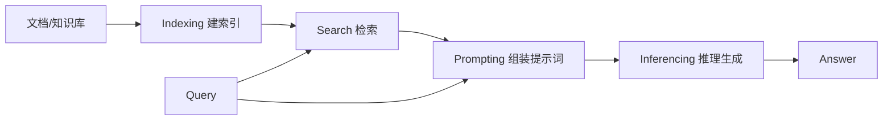
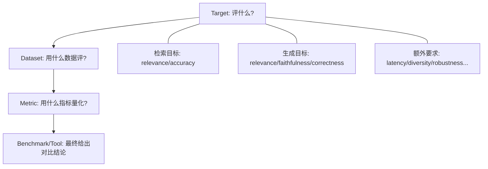

### [Evaluation of retrieval-augmented generation: A survey](https://link.springer.com/chapter/10.1007/978-981-96-1024-2_8)

 [被引用次数：281](https://scholar.google.com/scholar?cites=3204868390346020966&as_sdt=80005&sciodt=0,11&hl=zh-CN)

 Tencent Company  McGill University

Yu H, Gan A, Zhang K, et al. Evaluation of retrieval-augmented generation: A survey[C]//CCF Conference on Big Data. Singapore: Springer Nature Singapore, 2024: 102-120.

### RAG 系统的结构

#### A.1 检索组件

RAG系统的检索组件可分为三类：**稀疏检索**、**密集检索** 和 **网络搜索引擎**。评估的标准通常是输出相关文档及其数值评分或排名。

在神经网络引入之前，**稀疏检索**被广泛用于检索相关文本内容。像TF-IDF和 BM25  这样的方法依赖于关键词匹配和词频，但可能会遗漏那些没有关键词重叠但在语义上相关的文档。

通过利用BERT等深度学习模型，**密集检索**能够捕捉文本的语义含义，这使得它们即使在关键词重叠极少的情况下也能找到相关文档。对于需要上下文理解才能检索准确信息的复杂查询，这一点至关重要。随着**用于查询和文档的先进融合结构** 以及更高效的K-最近邻（KNN）实现，特别是**近似最近邻（ANN）**搜索技术的发展，密集检索方法在大规模应用中变得切实可行。

**网络搜索引擎**利用复杂的<u>在线搜索引擎</u>（如Google搜索 、必应搜索、DuckDuckGo ）来提供相关文档。RAG系统可以通过搜索提供商的API遍历网络上的海量信息，从而有可能返回更具多样性且语义相关的文档集。然而，搜索引擎的“黑盒”特性以及大规模搜索的费用有时并不划算。

观察发现，**密集检索技术，特别是那些利用嵌入（Embeddings）的技术，已成为RAG生态系统中的首选。这些方法经常与稀疏检索策略结合使用，形成一种混合方法，**以在信息检索的准确性和广度之间取得平衡。此外，采用复杂的网络搜索引擎进行基准评估，突显了它们在增强评估的稳健性和全面性方面日益增长的重要性。

**索引（Indexing）**
索引组件负责处理和索引文档集合，例如HuggingFace数据集或维基百科页面。在索引前进行**分块（Chunking）**可以提高检索效果，因为语义嵌入对于长篇文章的准确性较低，而所需内容通常很简短 。**索引创建旨在实现快速高效的搜索，例如用于稀疏检索的倒排索引和用于密集检索的ANN索引。**

- **稀疏检索：** 涉及计算每个词项的IDF，并将值存储在数据库中，以便在查询时快速查找和评分。
- **密集检索：** 使用像BERT这样的预训练语言模型将文档编码为密集向量。然后使用近似最近邻（ANN）搜索技术（如基于图的分层可导航小世界（HNSW）或倒排文件索引（IVF））对这些向量进行索引。该过程允许通过给定的预定义距离度量来高效地检索“闭集”项目。

**搜索（Search）**
这一步骤负责根据给定的查询检索相关文档。对于网络搜索引擎检索，使用相应的API提交查询以检索相关文档。对于本地资源，查询组件负责将查询格式化为不同稀疏或密集检索方法所需的格式。然后，**查询被提交给检索系统，系统返回一组相关文档及其评分**。

在本地和基于网络的场景中，都可以选择性地使用**重排序器（reranker）**来进一步优化检索到的文档的排名。重排序器通常由一个更复杂、更大的模型组成，该模型会考虑文档和给定查询的额外特征。这些额外特征通常包括查询与文档内容之间的语义关系、文档的重要性或流行度，以及针对特定信息需求的其他自定义度量。

------

#### A.2 生成组件

生成组件的可评估输出是大语言模型（LLM）的响应以及来自整理后响应的结构化或格式化输出。

**提示（Prompting）**
<u>生成过程的关键在于提示，即在该过程中，查询、检索结果和指令汇聚成一个单一的输入提供给语言模型</u>。研究表明，各种策略性的提示技巧，如**思维链（Chain of Thought, CoT）** 、**思维树（Tree of Thought, ToT）**和 **Self-Note**，都能显著影响模型的输出。这些方法，特别是逐步推理的方法，对于增强大语言模型处理复杂任务的能力至关重要。

提示技术的创新引入了诸如**改写与回应（Rephrase and Respond, RaR）**  等方法，**通过在提示中优化查询**来增强大语言模型的理解和响应能力。该技术已被证明可以在各种任务中提升性能。最新的特定领域RAG基准测试开始评估各种提示工程技能（包括CoT、RaR等）的鲁棒性。

**推理（Inference）**
在提示步骤中准备好的最终输入字符串随后作为输入传递给大语言模型，由其生成输出。推理阶段是大语言模型对检索阶段和提示阶段生成的输入进行处理，从而生成最终输出的阶段。这通常是针对初始查询的答案，并用于下游任务。

根据任务的具体要求或预期的输出结构，此处可能会实施一个**后处理（post-processing）**步骤，以适当地格式化生成的输出或从响应中提取特定信息。例如，对于分类问题（多选题），或者如果任务需要从生成的文本中提取特定信息，该步骤可能涉及额外的命名实体识别或解析操作。

------

## 1）读懂这篇论文需要提前掌握哪些基础知识？

### 1.1 先会“拆系统”：RAG = 检索 + 生成 + 中间过程

论文把 RAG 明确拆成 **Retrieval** 与 **Generation** 两大组件，并进一步拆成四个阶段：**indexing、search、prompting、inferencing**（见 Fig.1）。
你至少要知道每一步在干嘛：

- **Indexing**：把文档组织成可查的结构（倒排/向量索引等）
- **Search**：按 query 找相关文档（可有 reranker）
- **Prompting/Inferencing**：把“问题+证据”喂给 LLM，生成答案

------

### 1.2 评测“为什么难”：RAG 不是一个模型，而是一个混合系统

论文在挑战部分强调：评测要分别考虑 **检索、生成、以及整体系统的耦合**；尤其是外部知识源是**动态的**，而且检索与生成相互影响。

你需要理解三类难点：

- **检索评测**：不仅要看 precision/recall，还要考虑数据随时间变化、来源质量参差、误检/误导等问题
- **生成评测**：要看答案是否相关、是否忠实于证据、是否事实正确；开放式任务更难统一标准
- **整体评测**：不能只看“检索分数+生成分数”，要看检索到底有没有给生成带来增益，还要看延迟、可用性等工程指标

------

### 1.3 信息检索（IR）基础：排名指标 & 非排名指标

论文在“Metrics”章节把检索指标分为：

- **Non-rank based**：Accuracy、Precision、Recall@k 等
- **Rank-based**：MRR、MAP 等

你不必背公式，但要知道它们回答的问题不同：

- Precision：拿回来的里有多少是对的
- Recall@k：该拿回来的有没有被 top-k 覆盖
- MRR/MAP：相关内容排得靠不靠前（排序质量）

------

### 1.4 NLG/LLM 评测基础：参考答案指标 + “LLM as a Judge”

生成侧常见指标：ROUGE、BLEU、BERTScore 等（论文都有解释）
更关键的是这篇论文强调的趋势：**用 LLM 当裁判（LLM as a Judge）**，按一致的评分指南自动评估相关性、流畅性、覆盖度等。

------

## 2）用中文通熟易懂地解读论文（抓关键内容）

这篇 survey 的“主线”是：

> 提出一个统一的 RAG 评测分析框架 **Auepora**，用三个问题串起所有 benchmark：
> **What to Evaluate?（Target）→ How to Evaluate?（Dataset）→ How to Measure?（Metric）**

我用一张 Mermaid 把 Auepora 画成“评测流水线”：

------

### 2.1 Fig.1：这篇论文的“核心切入点”——EO 与 GT 的配对

Fig.1 特别重要：它把 RAG 系统里的可评对象分成 **Evaluable Outputs（EO）** 和 **Ground Truths（GT）**，并强调“评测目标”本质上就是 **EO 与 GT/Query/Docs 的配对关系**。

直觉理解：

- 检索侧 EO = “取回的文档”
- 生成侧 EO = “生成的答案/结构化输出”
- 评测就是看这些 EO 和 query、证据、标准答案之间的关系是否满足要求

------

### 2.2 Fig.2：Target 模块——RAG 评测应该至少覆盖哪些目标？

论文把 Target（What to evaluate）系统化成：

**检索（Retrieval）**两类关系：

- **Relevance（Relevant Docs ↔ Query）**：取回的内容是否对题
- **Accuracy（Relevant Docs ↔ Candidate Docs）**：排序/挑选是否把对的排前面

**生成（Generation）**三类关系：

- **Relevance（Response ↔ Query）**：答非所问吗
- **Faithfulness（Response ↔ Relevant Docs）**：是否“有证据支撑/不胡编”
- **Correctness（Response ↔ Sample Response）**：与参考答案是否一致（事实正确）

这其实就是评测 RAG 的“五件套”。

------

### 2.3 Table 1 & Table 2：当前 benchmark 都在评什么、用什么数据

- Table 1 汇总了 2023-2024（截至 2024.6）各种工具/基准（如 RAGAs、ARES、RGB、MultiHop-RAG、CRUD-RAG、DomainRAG、ReEval 等）覆盖的目标与常用指标，并指出很多工作会同时评多个方面。
- Table 2 总结各 benchmark 用的数据来源：有的复用 KILT/SuperGLUE 等经典数据，有的直接用 LLM 生成或用新闻/实时信息构造“动态评测”。

------

### 2.4 额外要求：从“学术指标”走向“工程可用”

论文专门强调除了检索与生成本身，还要评估：

- **Latency（延迟）**
- **Diversity（多样性）**
- **Noise Robustness（抗噪）**
- **Negative Rejection（信息不足时拒答）**
- **Counterfactual Robustness（遇到反事实/误导信息能识别）**

这部分很像“把 RAG 当产品来测”。

------

## 3）重要术语提取与通俗解释（按 Auepora 组织）

### 3.1 Auepora（A Unified Evaluation Process of RAG）

- **含义**：统一评测流程，把 benchmark 拆成 Target/Dataset/Metric 三模块，回答“评什么/怎么评/怎么量化”。
- **作用**：让你看任何 RAG benchmark 都能快速定位：它覆盖了哪些 EO↔GT 对，缺了哪些。

------

### 3.2 EOs / GTs（Evaluable Outputs / Ground Truths）

- **EOs**：系统产生、可被评估的输出（检索到的 docs、生成的 response 等）
- **GTs**：用于对比的标准（参考答案、标签、或候选文档集合）
  论文用 Fig.1 强调：Target 来自 EO 与 GT/Query/Docs 的组合关系。

------

### 3.3 Relevance / Accuracy / Faithfulness / Correctness（四大核心目标）

- **Relevance（相关性）**：检索是否对题、回答是否对题
- **Accuracy（检索准确/排序准确）**：是否把更相关的排前（需要候选集合对比）
- **Faithfulness（忠实性/可归因）**：回答是否严格来自证据，避免幻觉
- **Correctness（正确性）**：与参考答案的一致性，事实是否正确

------

### 3.4 Rank-based vs Non-rank metrics（排序指标 vs 非排序指标）

- **Non-rank**：只看“对/不对”，不关心排序位置（Accuracy/Precision/Recall@k）
- **Rank-based**：强调“对的是否排得靠前”（MRR/MAP）

------

### 3.5 LLM as a Judge（让大模型当裁判）

- **含义**：用 LLM 按评分标准给生成文本打分，适合 GT 难定义的开放式任务
- **论文观点**：趋势明显，但存在与人类偏好对齐、评分尺度统一、提示词标准化等挑战

------

### 3.6 Additional Requirements（额外要求）

把 RAG 当真实系统评：延迟、多样性、抗噪、拒答、反事实鲁棒等。

------

