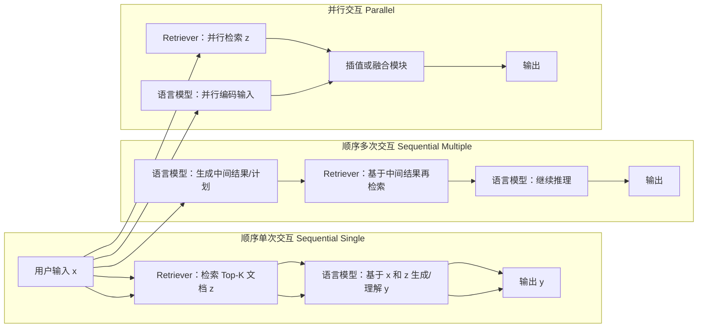

### [Rag and rau: A survey on retrieval-augmented language model in natural language processing](https://arxiv.org/abs/2404.19543)

[被引用次数：80](https://scholar.google.com/scholar?cites=4971034713770142627&as_sdt=80005&sciodt=0,11&hl=zh-CN)

Hu Y, Lu Y. Rag and rau: A survey on retrieval-augmented language model in natural language processing[J]. arXiv preprint arXiv:2404.19543, 2024.

East China University of Science and Technology

Peking University

下面我按你的 3 个需求来讲：**（1）读这篇综述前需要掌握的基础知识**、**（2）论文主线解读（抓关键）**、**（3）重要术语清单+通俗解释**。我会尽量用“中学生也能跟上”的方式讲，并穿插论文里的图表（如 Figure 1/2/6/7、Table 3）来对齐理解。

------

## 1）读懂这篇《RAG and RAU》前，需要哪些基础知识

### 1.1 先弄清：这篇在讲什么“总对象”

论文把 **RAG（检索增强生成）** 和 **RAU（检索增强理解）** 统一放进一个更大的概念：**RALM（Retrieval-Augmented Language Model，检索增强语言模型）**。
它给了一个非常核心的“公式级”抽象：**输出 = 语言模型(输入, 检索到的外部信息)**，写成
[y = F(x, z)]
其中 (x) 是输入，(z) 是检索到的信息。

你要提前理解的，就是这三件事如何协同：

- **Retriever（检索器）**：去哪找、怎么找、找哪些；
- **LM（语言模型）**：怎么“读懂并利用”检索结果；
- **Augmentation（增强方式）**：把检索到的东西，以什么方式塞进模型/推理流程里。

你可以把它想成“开卷考试系统”：
**检索器=翻书/搜资料**，**LM=答题**，**增强=怎么把资料贴到答题纸上**。

------

### 1.2 NLP & LLM 的最小必备：NLG / NLU + 两类语言模型

论文在导读处强调：生成类工作对应 **NLG**，理解类工作对应 **NLU**；它希望把 RAG/RAU 放回 NLP 任务谱系里看。

你要掌握两类语言模型的直觉差异：

- **AutoEncoder（自编码，BERT类）**：更擅长“理解/判断/分类”（NLU）。
- **AutoRegressive（自回归，GPT类）**：更擅长“续写/生成/对话”（NLG）。

这不是绝对，但足够作为“读综述时的第一把尺子”。

------

### 1.3 为什么需要检索增强：幻觉 + 知识更新慢

论文在摘要里点名：LLM 虽强，但会**幻觉**、需要**领域知识**、且**知识更新不及时**，所以引入外部检索来补。

------

### 1.4 RALM 的三种“交互结构”（最关键的结构化知识）

论文把“检索器如何与 LM 互动”分成 3 类（Figure 2），这是读完整篇的“骨架”。

我用一张 mermaid 帮你把 Figure 2 的意思“白话化”出来，Three different ways the Retriever interacts with the LM：

对应论文的定义：

- **顺序单次**：先检索 (P_\eta(z|x))，再让 LM 用 (x,z) 输出 token。
- **顺序多次**：多步推理/多轮对话中，LM 与检索会反复交替。
- **并行**：检索与 LM 独立处理输入，再用插值/融合得到输出。

> 你把这三种结构吃透，后面“检索器怎么做”“增强怎么做”“应用怎么分”都会变得顺理成章。

------

### 1.5 检索系统的必备常识：Top-K、向量检索、重排序

虽然综述更偏“总览”，但你至少要知道一个典型检索管线长啥样：

- **把文本变成向量（embedding）** → **近邻搜索（Top-K）** → **（可选）重排序 re-rank** → **把文档片段拼到上下文**
  以及一个常见现实问题：检索回来的内容可能**不相关、噪声大、甚至有害**，这会直接影响模型输出质量（论文在限制部分也强调了这一点）。

------

### 1.6 评估的必备常识：不仅看“答对没”，还要看“用没用对资料”

这篇综述专门总结了 RALM 的评估维度与方法（Table 3）：例如 **faithfulness（忠实性）**、**answer relevance（答案相关）**、**context relevance（上下文相关）**、**noise robustness（抗噪）**、**negative rejection（拒答能力）**、**counterfactual robustness（反事实鲁棒）** 等。

你可以把它理解成三问：

1. **检索到的资料相关吗？**
2. **回答有没有“紧贴资料”，而不是胡编？**
3. **遇到坏资料/噪声/诱导提示，系统扛得住吗？**

------

## 2）论文通俗解读：抓住它的“主线”和“关键结论”

### 2.1 论文结构一眼看懂（对齐 Figure 1）

论文在引言里用 Figure 1 给了总览：它要讲 **定义 → 组件（检索器/语言模型/增强）→ 数据来源 → 应用 → 评估 → 局限与未来**。

你读的时候就沿着这条线走，不容易迷路。

------

### 2.2 关键点 1：先用“交互方式”把 RALM 分门别类（Figure 2）

论文最强调的“新意”之一，是把 **Retriever–LM 的交互方式**系统化定义（Figure 2），并回顾每种方式的发展（文中也提到 Figure 3 是发展历史）。

直觉上：

- **单次顺序**：最简单、最常见，适合“一问一答”的场景；
- **多次顺序**：适合多跳问题、长对话、需要分步检索的任务；
- **并行**：更像“检索与模型各干各的，最后融合”，在一些结构化融合/加权场景可能好用。

------

### 2.3 关键点 2：应用怎么分？——按 NLG/NLU/两者皆要（Figure 6）

论文把应用按“更依赖生成还是更依赖理解”分三类，并用 Figure 6 画了分类图。

Figure 6 的核心信息（我把图里的层级结构复述一下）：

- **RALM on NLG（偏生成）**：如对话生成、机器翻译、数学教学等；
- **RALM on NLU（偏理解）**：如常识推理、知识图谱补全、事实核查、槽位填充等；
- **两者都要（NLU & NLG）**：如问答、代码生成与摘要、文本摘要等。

> 这对你理解“RAG vs RAU”很有帮助：
> **RAG 更常落在 NLG 主导的任务**，**RAU 更常落在 NLU 主导的任务**（但都属于 RALM 统一框架）。

------

### 2.4 关键点 3：评估方法开始“RALM 专用化”（Table 3）

早期大家用通用基准，后来逐渐出现 RALM 专用评估（论文第 8 节说得很直接）。

Table 3 给了代表性方法与其关注点，例如：

- **RAGAS**：强调 faithfulness、answer relevance、context relevance，并用模型辅助自动评估；
- **RGB**：双语评估体系，指标包括 accuracy、rejection rate、error detection rate，用来测抗噪、拒答、信息整合、反事实鲁棒等；
- 还有 CRUD-RAG、ARES、MIRAGE、RECALL 等在不同维度扩展评估（表格里列了对应数据集与勾选的维度）。

你读到评估这一章时，把它当作“做实验时我该报哪些指标”的清单就行。

------

### 2.5 关键点 4：这篇综述认为 RALM 的主要痛点（Figure 7 & 第 9 节）

论文第 9 节集中讨论局限与未来，并用 Figure 7 总结“问题 → 可能方向”。

它点出的核心限制包括（9.1 小节）：

- **鲁棒性差**：非常简单的 prefix attack 之类就可能降低相关性/准确性，甚至影响检索策略；
- **检索质量不稳定**：尤其用互联网时，来源质量差异大，直接融合可能引入噪声或误导；
- **成本“超支”**：复杂的预训练/微调、结构改造会带来时间与空间开销，扩展性变差；
- **应用仍偏少/偏套路**：还大量停留在问答、摘要等“早期LM就做的事”，需要更多真实落地来证明价值。

如果你要把这篇综述的“态度”浓缩成一句话：
**RALM 很有潜力，但瓶颈正从“会不会做”变成“检索可靠不可靠、系统稳不稳、成本能不能扛、能否产生新应用”。**（这句话是我概括，依据上面第 9 节的要点。）

------

## 3）重要术语提取 + 通俗解释（配合图表理解）

下面这份术语表，按你读论文最常卡住的顺序来列：

### A. 总体概念

- **RALM（Retrieval-Augmented Language Model）**：检索增强语言模型总称；把外部检索到的信息 (z) 融进模型函数 (F(x,z)) 得到输出。
- **RAG（Retrieval-Augmented Generation）**：偏“生成任务”的检索增强（例如对话、翻译、摘要等）。论文摘要把它与 RAU 并列作为 RALM 两种模式。
- **RAU（Retrieval-Augmented Understanding）**：偏“理解任务”的检索增强（例如事实核查、槽位填充、常识推理等）。同样在摘要中并列提出。

> 小提示：论文更常用 “RALM on NLG / on NLU” 来讲应用分类（Figure 6），你可把它当作 RAG/RAU 的“任务视角落地版”。

------

### B. 结构与交互（读 Figure 2 必备）

- **Sequential Single Interaction（顺序单次交互）**：检索一次 Top-K 文档 (z)，LM 直接用 (x+z) 生成/理解输出。
- **Sequential Multiple Interactions（顺序多次交互）**：多步推理中，LM 生成中间结果，再触发检索，再继续生成。
- **Parallel Interaction（并行交互）**：检索器与 LM 并行处理输入，最后用插值/融合函数 (I()) 汇总输出。
- **Top-K**：检索器返回最相关的 K 条内容（你可以理解为“开卷只允许带 K 张小抄”）。

------

### C. 模型类型（读第 4 节常卡的）

- **AutoEncoder LM（自编码/BERT类）**：更适合 NLU（理解、判断、分类）。
- **AutoRegressive LM（自回归/GPT类）**：更适合 NLG（对话、翻译等生成）。
- **Hallucination（幻觉）**：模型输出看似合理但无依据/不正确；论文在摘要中把它作为引入检索增强的动机之一。

------

### D. 应用分类（读 Figure 6 必备）

- **RALM on NLG / on NLU / on Both**：按“更依赖生成还是理解”划分应用版图；Figure 6 给出具体任务与代表工作列表。

------

### E. 评估维度与方法（读 Table 3 必备）

- **Faithfulness（忠实性）**：回答是否与“提供的上下文/证据”一致（不是自说自话）。
- **Answer relevance（答案相关性）**：回答是否真正回应了问题。
- **Context relevance（上下文相关性）**：检索到的上下文是否集中、少废话、少无关内容。
- **Noise robustness（抗噪）/ Negative rejection（拒答）/ Counterfactual robustness（反事实鲁棒）**：在噪声数据、诱导信息、反事实场景下系统是否还稳。Table 3 用勾选方式总结这些维度。
- **RAGAS / RGB 等评估框架**：论文在第 8 节给出其指标与数据集概况（并汇总进 Table 3）。

------

### F. 局限与未来（读 Figure 7 & 第 9 节必备）

- **Poor robustness（鲁棒性差）**：可能被简单前缀攻击影响质量甚至检索策略。
- **Poor retrieval quality（检索质量差）**：来源参差（尤其互联网），融合不当会引入噪声/误导。
- **Overspending（成本超支）**：复杂训练/结构改造导致时间与空间开销上升，扩展性下降。
- **Few applications（应用偏少）**：仍集中在早期任务，需要更多真正“用起来”的场景。

