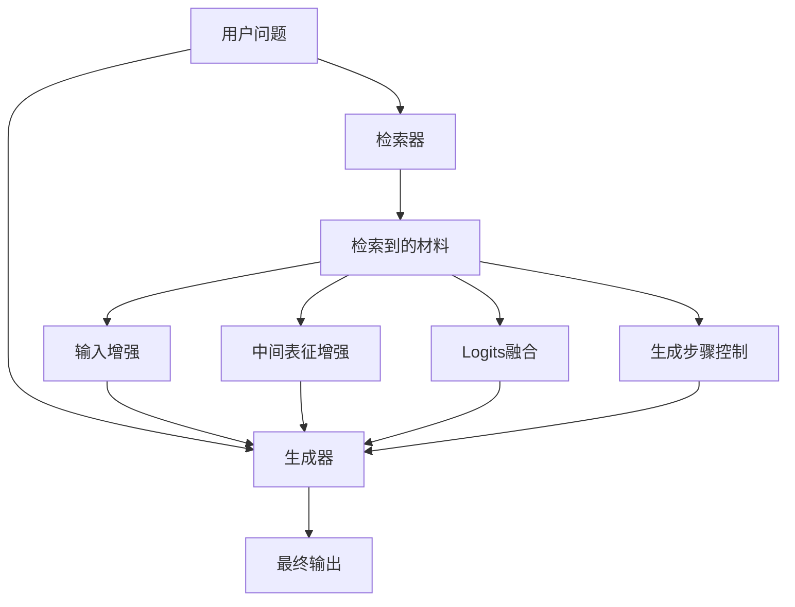

### [Retrieval-augmented generation for ai-generated content: A survey](https://arxiv.org/abs/2402.19473)

 [被引用次数：600](https://scholar.google.com/scholar?cites=14452718092018481370&as_sdt=80005&sciodt=0,11&hl=zh-CN)

Zhao P, Zhang H, Yu Q, et al. Retrieval-augmented generation for ai-generated content: A survey[J]. arXiv preprint arXiv:2402.19473, 2024.

Peking University

下面按你的 3 个任务来（针对论文 **《Retrieval-Augmented Generation for AI-Generated Content: A Survey》**）。我会尽量用“中学生也能懂”的方式讲，并配合 **mermaid** 图（这次我会避免你之前遇到的解析报错点：节点里不写括号、斜杠、奇怪符号；尽量用纯中文或纯英文短词）。

------

## 1) 读懂这篇论文需要的基础知识（通俗版）

### 1.1 你需要先搞懂：RAG 到底在干什么

这篇综述把 RAG 描述成一个“两件套系统”：

- **Retriever（检索器）**：拿着你的问题去“资料库”里找相关信息
- **Generator（生成器）**：把“问题 + 检索到的材料”结合起来生成答案/内容

论文给了一个通用流程：先检索，再把检索结果以某种“增强方式”送进生成器，最后输出多模态内容（文本、图像、代码等）。

你可以先记成一句话：**RAG = 先查资料，再写答案。**

### 1.2 四种“增强方式”（这篇综述的核心抓手）

论文强调：检索结果并不一定只是“拼接到输入文本里”，它还有多种“插入点/作用方式”，并据此总结了几类 foundations（基础范式）：

- 把检索结果当作 **输入增强**（augmented input）
- 在生成过程的 **中间层** 以 **latent representation** 形式融入
- 在最后输出时用 **logits** 融合影响最终词/token选择
- 甚至能 **影响或跳过某些生成步骤**（更像“控制生成流程”）

用一张图把它“钉住”：

（上面这张图对应论文对“检索结果如何增强生成”的几类总结。）

### 1.3 你还需要的“配套常识”

为了读顺这篇综述，建议你至少熟悉这些概念（不用特别深）：

- **检索的基本范式**：稀疏检索 vs 稠密检索（以及“表示—建索引—相似度搜索”的套路）
- **生成器是什么**：在 AIGC 里不只有 Transformer，还可能有 LSTM、Diffusion、GAN 等，论文也放在 preliminaries 里概述了（并在 Fig.2 画了通用结构）。
- **“增强”不等于“更真实”**：RAG 的关键挑战在于：检索不准、材料冲突、融合方式不当，都可能让生成更差（这也是后面 enhancements/benchmarks/limitations 讨论的动机）。

------

## 2) 论文解读（抓重点，按它的组织逻辑）

这篇综述的写法很“工程化”：先给 **总架构**，再给 **基础范式 foundations**，再讲 **增强 enhancements**，最后讨论 **应用/基准/局限与未来方向**。

### 2.1 总架构：通用 RAG（Fig.1）

Fig.1 给的是“万金油模板”：问题同时喂给检索器和生成器；检索器从数据源拿材料；生成器与材料交互后输出多模态结果。

你可以把它理解成一个“闭环”：
**问题不变，但材料可变；材料一变，生成就可能更准、更可控。**

### 2.2 Foundations：RAG 不止“拼接上下文”

论文特别想纠正一个常见误解：很多人以为 RAG 就是“把检索到的段落粘贴到 prompt 里”，但其实还有另外三类基础范式：中间表征、logits融合、生成步骤控制。

这背后的直觉是：

- **输入增强**：最简单，但容易被 prompt 长度限制、也容易引入噪声
- **中间表征增强**：更“模型内部融合”，可能更稳定
- **logits 融合**：更像“投票/校正”，直接影响最终输出选择
- **步骤控制**：更像“让模型知道何时该查、何时该写”（对复杂任务/多步推理更重要）

### 2.3 Enhancements：把 RAG 做“更像产品可用”

论文把大量工作归纳到“增强手段”上，并画了一个 taxonomy（Fig.4）。
你可以先用一个“产品视角”的流程来记：

其中，综述里举的增强例子包括（我用更口语的方式总结）：

- **混合检索**：稀疏 + 稠密一起上，互补词面与语义
- **重排序 rerank**：先粗搜，再精排，把最有用的材料顶上去
- **检索结果“提纯/改写”**：删掉无关内容、压缩、只保留证据点，降低生成负担
- **检索器微调**：用领域数据把 embedding/检索模型调得更“懂你这个场景”

------

## 3) 重要术语表（通俗解释 + 怎么用）

下面这些是读这篇综述时最“承重”的术语（我按“你在做系统/写论文时会直接用到”的程度排）：

### 3.1 RAG（Retrieval-Augmented Generation）

**检索增强生成**：先找资料，再生成。核心两模块：retriever + generator。

### 3.2 Retriever（检索器）

把“信息需求”变成一次搜索，返回 top-k 相关内容。稀疏/稠密检索的基本流程是：先编码表示，再建索引，再相似度搜索。

### 3.3 Generator（生成器）

负责把“问题 + 检索材料”变成最终内容。在 AIGC 里生成器可能是 Transformer，也可能是 Diffusion、GAN 等（多模态场景尤甚）。

### 3.4 Foundations（基础范式）

指“检索结果以什么方式进入生成过程”。这篇综述明确列了多类：输入增强、中间表征、logits、步骤控制。

### 3.5 Enhancements（增强技术）

在基础范式之上做优化：比如混合检索、重排序、检索结果改写/压缩、检索器微调等，并用 Fig.4 做了分类总结。

### 3.6 Hybrid Retrieval（混合检索）

同时用稀疏与稠密检索：稀疏擅长关键词精确匹配，稠密擅长语义近邻；混合常能更稳。

### 3.7 Re-ranking（重排序）

对初筛结果再精排，追求更相关、更少噪声、更高多样性。

------

