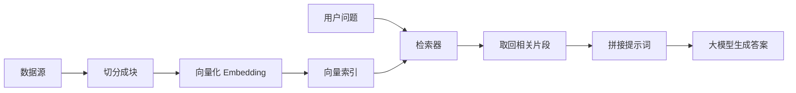
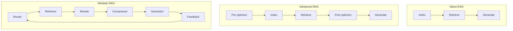
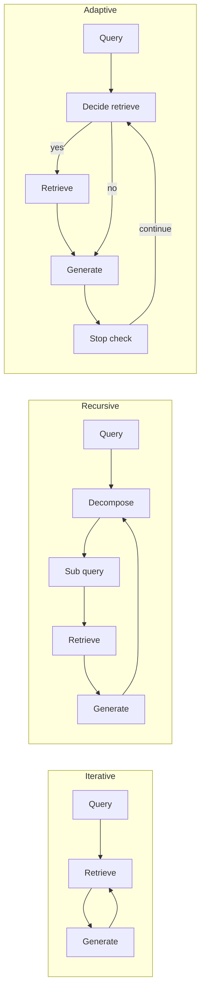

### [PDF] [Retrieval-augmented generation for large language models: A survey](https://simg.baai.ac.cn/paperfile/25a43194-c74c-4cd3-b60f-0a1f27f8b8af.pdf)

 [被引用次数：3941](https://scholar.google.com/scholar?cites=9082880950785936523&as_sdt=80005&sciodt=0,11&hl=zh-CN)

Gao Y, Xiong Y, Gao X, et al. Retrieval-augmented generation for large language models: A survey[J]. arXiv preprint arXiv:2312.10997, 2023, 2(1).

 Tongji University 

Fudan University

下面按你的 3 个需求，把《**Retrieval-Augmented Generation for Large Language Models: A Survey**》这篇综述“读懂所需基础 → 论文主线解读 → 重要术语表”一次讲清楚，并穿插论文里的**图/表**与可运行的 **Mermaid**（我会刻意避开容易导致解析错误的括号、斜杠等符号）。

------

## 1) 读懂这篇论文需要的基础知识（通俗版）

### 1.1 先搞懂：RAG 到底在解决什么？

一句话：**让大模型在生成答案前，先去“查资料”再回答**，从而提升准确性、可追溯性，减少胡编。论文也强调：一次性塞超长上下文会拖慢推理；而 RAG 的“按需分块检索 + 引用可追踪”有优势。

### 1.2 三件套：Indexing、Retrieval、Generation（论文称 Naive RAG）

你至少要理解这三步分别在干嘛，论文用图对比了三种范式（Naive / Advanced / Modular），其中 Naive 就是最基础的链式流程。

**可运行 Mermaid：Naive RAG 最小闭环**

### 1.3 检索基础：你需要知道“检索从哪里来、以什么粒度来、怎么嵌入”

论文在“Retrieval”部分把关键问题拆得很清楚：**Retrieval source（数据源类型）、Granularity（检索粒度）、Pre-processing、Embedding model** 等，并在 Table I 里用大量方法做了归纳（例如数据源从 Wikipedia 扩展到 KG、PDF 等；粒度从 phrase/sentence 到 chunk）。

你需要的最小知识点：

- **向量检索**：embedding + 向量索引 + 相似度搜索
- **粒度权衡**：句子/段落/Chunk 越大，信息更全但噪声更大；越小更精准但容易断上下文（Table I 里就是按粒度在分门别类）
- **重排序与压缩**：取回的不一定都该喂给模型，需要 rerank、compress，避免信息过载（Advanced RAG 的核心之一）

### 1.4 从“链式”到“更聪明”：Advanced RAG 与 Modular RAG

论文用 Fig.3 的文字解释了：

- **Advanced RAG**：围绕 *pre-retrieval* 与 *post-retrieval* 做优化，但仍偏链式
- **Modular RAG**：可以插模块、换模块，甚至支持迭代/自适应检索，不再局限“检索→生成”顺序

**三种范式对比**

### 1.5 “一次检索不够用”：迭代、递归、自适应检索

论文在 Fig.5 总结了三类检索增强流程：

- **Iterative**：检索与生成交替，多轮补信息
- **Recursive**：把问题逐步拆成子问题，边改写边检索
- **Adaptive**：模型自己决定要不要检索、何时停止（常用特殊 token 或反馈信号控制）

**三类检索增强（对应 Fig.5 的“左中右”）**

### 1.6 评估基础：不仅看“答对没”，还要看“检索是否相关、回答是否忠实”

论文给了 Table IV：把评估框架分成 benchmark 或 tool，并列出关注点（Context relevance、Faithfulness、Answer relevance、Noise robustness 等）。

------

## 2) 论文主线解读（抓重点）

### 2.1 这篇综述的“总框架”

你可以把它理解为在回答 4 个核心问题：

1. **RAG 长什么样**：从 Naive → Advanced → Modular（Fig.3）
2. **检索怎么做**：数据源、粒度、预处理、embedding 等（Retrieval 章节 + Table I）
3. **检索与生成怎么融合与增强**：一次检索之外的 iterative/recursive/adaptive（Fig.5）
4. **怎么评估好不好**：RAGAS、ARES、TruLens、RGB、RECALL、CRUD 等（Table IV）

### 2.2 Table I：作者在“分类学”上做了什么贡献？

Table I 用几个维度把大量 RAG 方法放在一个表里：
**Retrieval Source、Retrieval data type、Granularity、Augmentation stage、Retrieval process**（例如 once/iterative/adaptive）。这其实是在给你一个“快速定位方法差异”的坐标系。

你读表时可以用一个“最实用”的提问方式：

- 它检索什么（Wikipedia / 搜索引擎 / 合成数据 / 预训练语料 …）
- 以什么粒度检索（phrase / sentence / chunk …）
- 在训练还是推理阶段增强（pre-training / tuning / inference）
- 是一次还是多次（once / iterative / adaptive）

### 2.3 Fig.5：为什么需要“多轮检索”？

论文明确指出：**一次检索 + 生成**对复杂问题、多步推理可能不够，因此出现了多种检索增强流程（Fig.5），并分别说明了 iterative/recursive 的典型用途与潜在问题（例如迭代可能累积无关信息）。

### 2.4 Table IV：评估为什么变得“系统化”？

因为仅靠 EM/F1/ROUGE 这类下游指标，很难覆盖 RAG 的多维挑战；所以出现了专门的评估工具/基准，把“检索质量、回答忠实度、上下文相关性、抗噪声”等拆开评。Table IV 就是这类框架的对照表。

------

## 3) 重要术语清单（通俗解释 + 对应论文位置）

> 我按“读论文最常卡住的点”来选词（结构、检索、增强流程、评估）。

### 3.1 架构与流程类

- **Naive RAG**：最基础三段式：Indexing → Retrieval → Generation（Fig.3 左）
- **Advanced RAG**：在检索前后做优化（query 改写、索引优化、rerank、compress），但整体仍是链式（Fig.3 中）
- **Modular RAG**：模块化拼装与替换（Search、Memory、Routing、Predict、Task Adapter 等），甚至支持迭代和自适应检索（Fig.3 右的文字解释）

### 3.2 检索关键要素类

- **Retrieval source**：检索的外部知识从哪里来（纯文本 → 半结构 PDF → 结构化 KG 等都可能）
- **Retrieval granularity**：检索单元大小（phrase/sentence/chunk…），直接影响噪声与信息完整度（Table I 的核心维度之一）
- **Pre-retrieval / Post-retrieval**：检索前优化 query 和索引；检索后做 rerank、compress，避免信息过载

### 3.3 检索增强流程类（Fig.5）

- **Iterative retrieval**：检索与生成交替，多轮补充上下文（Fig.5 左）
- **Recursive retrieval**：不断细化 query 或拆分子问题，逐层逼近答案（Fig.5 中）
- **Adaptive retrieval**：模型自己决定何时检索、何时停止（Fig.5 右）

### 3.4 评估类（Table IV）

- **Context relevance**：取回的上下文是否真的和问题相关（RAGAS/ARES/TruLens 都关注）
- **Faithfulness**：回答是否“忠实于检索到的证据”，而不是自己编（RAGAS/ARES/TruLens）
- **Noise robustness / Counterfactual robustness**：检索到噪声或反事实信息时是否能扛得住（RGB、RECALL 等）
- **Negative rejection**：当检索不到可靠依据时，是否能拒答或谨慎答（RGB）

------

