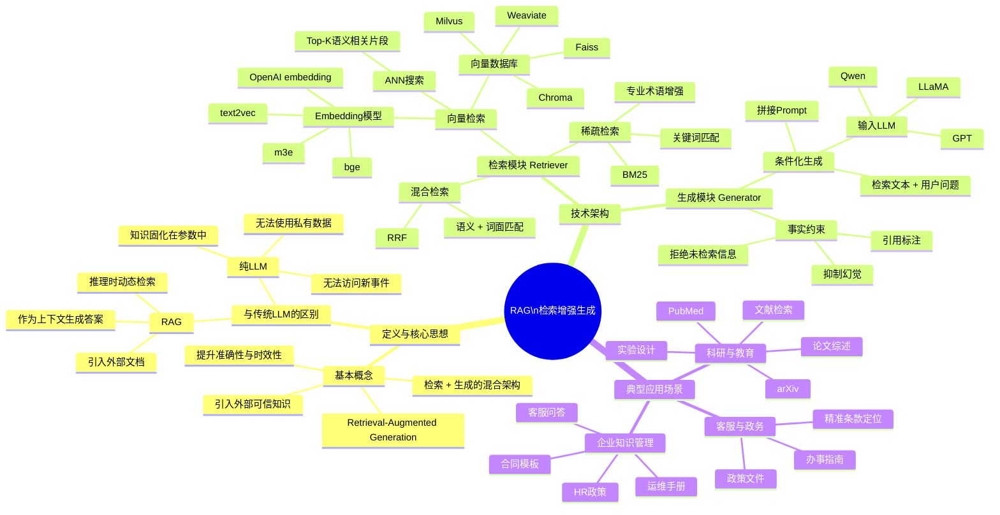
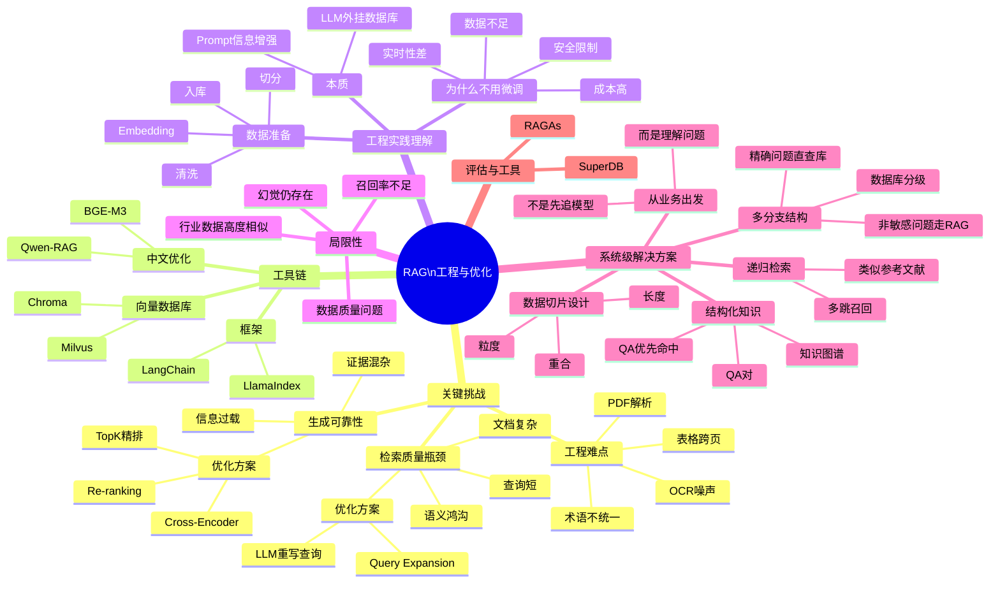

------

# Mermaid Mindmap（Part 1）：RAG 核心结构与应用



------

# Mermaid Mindmap（Part 2）：工程落地、挑战与优化



------

# RAG（检索增强生成）思维导图 · Markdown 版

------

## 一、RAG 的定义与核心思想

### 1. 基本概念

- RAG（Retrieval-Augmented Generation）
- 将 **外部知识检索** 与 **大语言模型生成能力** 相结合的混合架构
- 核心目标：
  - 提升事实准确性
  - 解决知识时效性问题
  - 提升专业领域回答质量

### 2. 与传统 LLM 的区别

- 纯 LLM（如 GPT-3、ChatGLM2）
  - 仅依赖参数中固化知识
  - 无法访问训练后新知识
  - 无法使用私有数据
- RAG 模型
  - 推理时动态检索外部文档
  - 将检索结果作为上下文输入 LLM
  - 支持最新数据 / 企业内部数据

------

## 二、RAG 技术架构

### 1. 检索模块（Retriever）

#### （1）向量检索（Dense Retrieval）

- 使用 Embedding 模型
  - bge-small-zh
  - text2vec-large-chinese
  - OpenAI embedding
  - m3e 等
- 将：
  - 用户查询
  - 文档切块
    → 编码为稠密向量
- 在向量数据库中执行 ANN 搜索
  - 返回 Top-K 语义最相关文本块
- 常见向量数据库：
  - Milvus
  - Chroma
  - Weaviate
  - Faiss

**示例**

> 查询：“iPhone 15 Pro 的钛金属边框有何优势？”
> → 检索包含“钛合金 / 强度 / 减重”的官方文档段落

------

#### （2）关键词 / 稀疏检索（Sparse Retrieval，可选）

- 基于 BM25 的 TF-IDF 词频匹配
- 强化：
  - 专业术语
  - 编号
  - 法条
- 常与向量检索融合
  - RRF（Reciprocal Rank Fusion）
  - Hybrid Search

------

### 2. 生成模块（Generator）

#### （1）条件化生成

- Prompt 结构示例：

  ```
  根据以下资料回答问题：
  [检索文本1]
  [检索文本2]
  …
  问题：{用户问题}
  ```

- 常用 LLM：

  - Qwen2-7B
  - Llama3-8B
  - GPT-4

- 特点：

  - 生成必须基于证据
  - 避免自由发挥

#### （2）事实约束机制

- 引用标注（Citation）
- Hallucination Suppression（拒答机制）
- 证据缺失时明确说明“不存在该信息”

------

## 三、典型应用场景

### 1. 企业知识管理

- 应用：
  - HR 政策
  - IT 运维手册
  - 合同模板
- 示例：
  - 客服查询“异地出险如何定损？”
  - 自动定位《理赔指引》第 4.7 条
  - 输出结构化答复

------

### 2. 科研与教育

- 数据源：
  - arXiv
  - CNKI
  - PubMed
- 功能：
  - 文献综述
  - 实验设计辅助
- 示例：
  - BioMedRAG
  - 检索 2023 年 CRISPR 对比实验论文

------

### 3. 客服与政务

- 对接政府公开文件
- 示例：
  - “随申办”App
  - 查询医保政策
  - 自动抽取：
    - 参保条件
    - 缴费基数
    - 办理流程

------

## 四、关键挑战与优化方向

### 1. 检索质量瓶颈

#### 问题

- 查询短 vs 文档复杂
- 语义鸿沟严重

#### 优化方案

- Query Expansion
- LLM 重写查询
- 同义词扩展

------

### 2. 生成可靠性风险

#### 问题

- 信息过载
- 证据混杂

#### 优化方案

- Re-ranking
- Cross-Encoder（如 bge-reranker-base）
- Top-20 → 精排 → Top-3

------

### 3. 工程落地难点

- 文档预处理复杂
  - PDF 表格
  - OCR 噪声
  - 页眉页脚
  - 跨页表格
- 术语标准化
  - 年利率 / APR / 月息

------

## 五、主流开源工具链

### 1. 检索基础设施

- Chroma
  - 轻量
  - Python 友好
- Milvus
  - 亿级向量
  - 高并发

------

### 2. 端到端框架

- LlamaIndex
  - 数据连接器
  - 索引构建
- LangChain
  - Retriever / LLM / Agent
  - 工作流编排

------

### 3. 中文专项优化

- BGE 系列
  - bge-m3（多语言 / 多粒度 / 多任务）
- Qwen-RAG
  - 中文法律 / 医疗场景
  - 检索准确率显著提升

------

## 六、直观理解 RAG（工程视角）

### 1. 本质理解

- 给 LLM **外挂一个数据库**
- 扩展 Prompt 的信息密度

------

### 2. 数据准备流程

- 支持任意格式
- LangChain / LlamaIndex 自动化
- 流程：
  - 清洗
  - 切分（如每 1000 字）
  - Embedding
  - 向量入库

------

### 3. 为什么不用微调？

- 数据质量不足
- 算力成本高
- 实时性差
- 企业安全限制

------

## 七、RAG 的局限性

- 召回率低
- 本地数据质量差
- 行业数据高度相似
- LLM 幻觉仍存在

------

## 八、系统级解决方案

### 1. 从业务出发

- 不是先追新模型
- 而是理解业务问法

------

### 2. 数据切片设计

- 长度
- 重合
- 粒度
- 结构化优先

------

### 3. 多分支检索策略

- 精确问题 → 直接查数据库
- 非敏感问题 → LLM + 记忆
- 数据分级 / 分库
- 不同问题访问不同表

------

### 4. 递归检索

- 类似“参考文献的参考文献”
- 多跳召回 → 汇总 → 再生成

------

### 5. 融合结构化知识

- 构建 QA 对
- 构建知识图谱（KG）
- 优先命中 QA
- 未命中再走 RAG

------

## 九、评估与工具

- RAGAs：RAG 应用评估框架
- SuperDB：
  - 数据库
  - 数据表工具包

------

