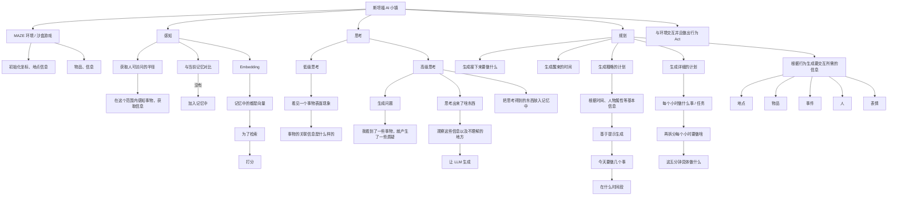
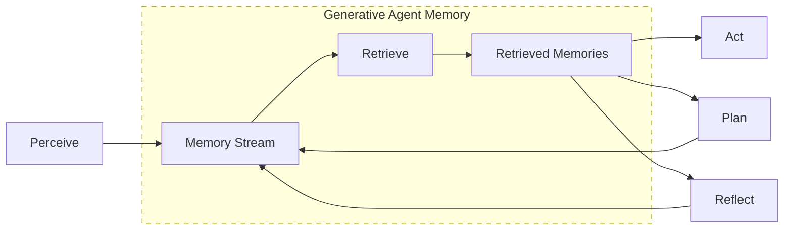

**“斯坦福小镇论文”**（2023，Stanford + Google）👇

> **Generative Agents: Interactive Simulacra of Human Behavior**
> *Joon Sung Park et al., Stanford University*
>
> https://github.com/joonspk-research/generative_agents

------

remember :记录信息。每个人可以看做一个记忆数据库，把看到的信息都记录进来。

reflect：反思。比如，我遇到一个人，该生成什么话，需要到记忆库检索和这个人有什么相关的，还要看我的plan，今天有没有什么和这个人相关的。

- 先**感知**（在周围的世界看到了什么，每一步都需要问大模型LLM），

- 再**思考**（看到的东西生成了什么记忆，对我来说意味着什么，用LLM总结），

- 再**反思**（思考了很多问题，但仅仅是结合看到的是，没有结合长期的考虑，反思就是结合这些思考做一个全局考虑，也是问LLM做进一步总结，生成新的特征）

- **制定计划**Plan

- **执行行为**

## 一、这篇论文在做什么？

> **用大语言模型 + 记忆检索机制，构建一个“会记忆、会规划、会社交”的虚拟人小镇。**

25 个 AI Agent 生活在一个虚拟小镇里：

- 会起床、工作、吃饭
- 会聊天、**<u>传播消息</u>**
- 会计划生日派对
- 行为**不是脚本写死的，而是“生成式”的**（Agent的每一句话都是LLM生成出来的）

👉 这不是游戏论文，而是 **Agent 架构 + 记忆检索（RAG-like）+ 行为生成** 的开创性工作。

------

## 二、为什么它叫“斯坦福小镇”？

论文中构建了一个 **Smallville（小镇）**：

- 地点：咖啡馆、房子、公园、商店
- 居民：25 个 AI Agent
- 时间：以“分钟”为粒度推进
- 每个 Agent 都由 **LLM 驱动**

你可以把它理解成：

> **一个“社会级别的、多智能体 RAG 系统”**

------

## 三、核心技术架构

论文的 Agent 不是直接「Prompt → LLM → 行为」，而是一个**三层认知循环**：

------

### 🧠 Agent 核心循环（论文原话）

感知模块：日志任务当中，随着时间推移不断更新，怎么更新保存重要的信息？/当前关注到的总结后的信息保存那些? /Agent每走一步要观察好多东西，哪一个影响最大？

- 时效性 （自动衰减）

- 重要性 （大模型重要性打分）

- 相关性（余弦相似度）[0,1]之间分数

思考模块：

先提一个问题，再抽取最相关的100个总结的信息，生成接下来的计划

### 1️⃣ Memory（记忆模块）【RAG 核心】

Agent 的所有经历都会被存成 **自然语言记忆**：

- “我今天早上 8 点在咖啡馆见到了 Alice”
- “Sam 提到他最近心情不好”
- “今天是我的生日”

📌 每条记忆都有：

- 内容（文本）
- 时间戳
- 重要性（importance score）
- 向量 embedding

👉 **这是一个典型的 RAG Memory Store**

------

### 2️⃣ Memory Retrieval（检索机制）

当 Agent 要思考 / 行动时，会从记忆库中**检索相关记忆**，基于三个维度打分：

| 维度       | 含义                                       |
| ---------- | ------------------------------------------ |
| Relevance  | 与当前问题的语义相关性（Embedding 相似度） |
| Recency    | 最近发生的事情权重大                       |
| Importance | 重要事件（如生日、冲突）权重大             |

📌 最终用加权公式选 Top-K 记忆
👉 **这一步 = RAG 的 Retriever**

------

### 3️⃣ Reflection（反思 / 抽象）

这是论文的一个**关键创新点**：

Agent 会定期对记忆进行“反思”，生成**高层总结**：

- 从多条低层记忆 → 抽象出一个结论
- 例如：
  - 多次聊天 → “Alice 和 Bob 最近关系变近了”
  - 多次负面事件 → “我最近压力很大”

📌 这些 **Reflection 本身也会被写回记忆库**

> 这相当于：
> **LLM 自动生成“长期知识 / 中间概念”**

------

### 4️⃣ Planning（规划）

Agent 会生成 **日程计划（Plan）**：

- “9:00–10:00 在家吃早饭”
- “10:00–12:00 去咖啡馆工作”
- “晚上给 Sam 办生日派对”

📌 Plan 也是文本
📌 会被不断更新（Re-plan）

------

### 5️⃣ Action（行为生成）

最终行为由 LLM 生成：

- 去哪里
- 做什么
- 和谁说话
- 说什么内容

## 四、为什么这篇论文这么重要？

### 1️⃣ 它不是 Prompt Engineering，而是 **Agent Architecture**

第一次系统性提出：

- **<u>记忆</u> ≠ 上下文窗口**
- 而是一个：
  - 可检索
  - 可反思
  - 可长期积累
    的<u>外部认知系统</u>

👉 这是 **Agent + RAG** 的经典范式

------

### 2️⃣ 它验证了：LLM 可以涌现“社会行为”

论文中出现了❤：

- <u>消息自然传播</u>
- <u>社交关系演化</u>
- <u>集体活动（派对）</u>
- <u>角色一致性（persona stability）</u>

而这些**都没有硬编码规则**（no pre-programmed）。

------

### 3️⃣ 它启发了后续几乎所有 Agent 框架

你现在看到的很多东西，源头❤都在这里：

- LangChain Memory
- AutoGPT / BabyAGI
- CrewAI / MetaGPT
- 社会仿真、多智能体博弈
- LLM + 记忆 + 规划

------

## 五、它和RAG 有什么关系？

如果你从 **RAG 视角**看这篇论文，会发现：

### ✅ 它本质是一个「行为级 RAG 系统」

| RAG 组件  | 斯坦福小镇对应                   |
| --------- | -------------------------------- |
| 文档库    | Agent 的长期记忆                 |
| Embedding | 记忆向量                         |
| Retriever | relevance + recency + importance |
| Generator | LLM 行为 / 对话 / 规划           |
| Rerank    | 加权打分                         |
| Chunk     | 单条自然语言记忆                 |

👉 区别只是：
**RAG 的“文档”变成了“人生经历”**

------

## 六、这篇论文的局限性

- 所有 Agent 共享同一个强 LLM（现实不可扩展）
- Memory 全是自然语言，**缺乏结构化约束**
- 没有严格评测指标（偏 qualitative）
- 行为“看起来像人”，但不可控、不可验证
- 成本极高（token 巨多）

------

