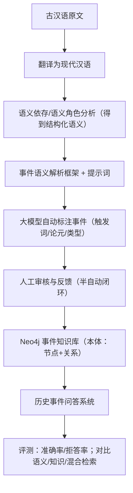
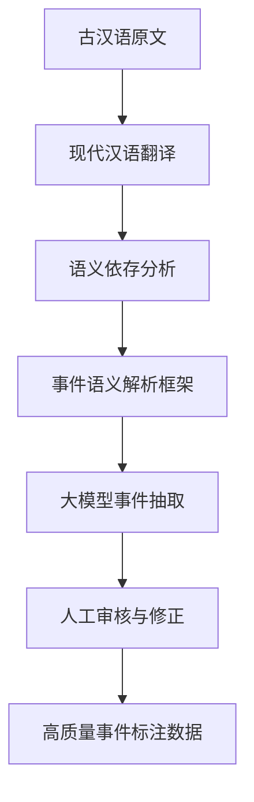
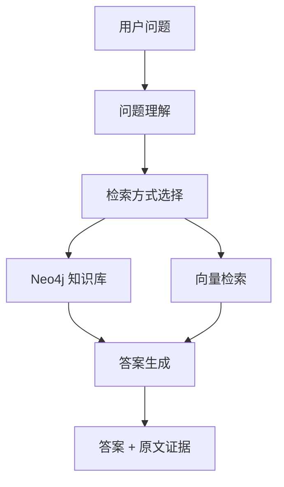

古汉语历史文本事件抽取 相关论文

------

## 1）读懂这篇论文需要的基础知识

### A. 你要先懂：这篇论文在解决什么问题？

**把古汉语史书里的“事件”抽出来，做成 Neo4j 知识库，再做一个可追溯的历史事件问答系统**。核心方法之一是“双层语义映射”的半自动标注/抽取框架（基于双层语义映射的 大语言模型辅助 古汉语事件抽取 半自动标注 框架示意图）。

------

### B. 古汉语与“事件”的基本概念

1. **古汉语特点**：省略多、语序灵活、同一句可有多种解释；翻成现代汉语往往更长（论文也强调“译文可能需要更长篇幅”）。
2. **事件抽取（Event Extraction）**最常见三件套：

- **触发词**：像“伐、诛、立、迁、卒”等，提示“发生了什么”
- **论元/要素**：谁（人物）、在哪（地点）、何时（时间）、对谁/什么（客体）
- **事件类型**：战争/任免/朝贡/迁徙等（论文用“事件语义学理论 + 语义依存”去落地成框架）。

------

### C. NLP 方面你需要的“最小必备包”

1. **中文分词、命名实体识别 NER**：把“人名/地名/官职”等找出来。论文在问答系统中明确用 **HanLP**（一个功能强大的多语言NLP库，专为研究人员和企业打造） 做分词、NER、语义角色标注。
2. **语义角色标注 SRL / 语义依存分析**：把句子拆成“谁做了什么、作用到谁”，相当于“句子事件骨架”。论文的第一层映射就是：**古→今翻译后，用语义依存得到更丰富语义表示**。
3. **向量相似度/余弦相似度**：用来衡量“原文-译文”对齐是否语义一致。论文给了对齐后的余弦相似度与人工评估准确率（表3、表4）。

------

### D. 大模型与“半自动标注”的基础

你要理解：大模型不是直接当“真理机器”，而是当**提效的标注员**。论文把它放进“自动标注 + 人审反馈”的半自动流程里，并强调这样能兼顾效率与可靠性。

------

### E. 知识图谱与 Neo4j 基础

1. **本体（Ontology）**：你要先会把世界抽象成“节点类型 + 关系类型”。论文明确：事件知识库基于 Neo4j，本体由节点类型与关系类型构成，并给出整体结构图（图16）。
2. **Cypher 查询语言**：在 Neo4j 里“怎么查人-地-事-文献出处”。论文提到用 CSV 导入并用 Cypher 构建图谱与约束。

------

### F. 问答系统与评测基础

1. **检索方式**：语义检索/知识检索/混合检索
2. **评测指标**：准确率、拒答率
   论文结论：**混合检索整体最好，准确率最高到 88.50%，拒答率最低到 5.20%**（图32相关段落）。

------

### 用一张“总流程图”把论文读法串起来

------

## 2）这篇论文的通俗解读

### 2.1 双层语义映射：为什么要“绕一圈”？

论文提出的核心框架是**基于双层语义映射的大模型辅助半自动标注**（图6）。要点是两层映射：

- **第一层**：古汉语不好直接做稳定的自动理解 → 先翻译成现代汉语，再做语义依存，得到“更显式”的语义结构
- **第二层**：把语义依存结构继续映射成“事件信息”（触发词、论元等），并用提示词让大模型更像“按规范填表”

你可以把它理解成：

> 先把“古文的压缩包”解压成现代汉语，再把句子骨架（语义依存）画出来，最后让大模型在骨架上“填事件表格”。

------

### 2.2 层次化语义对齐：翻译之后怎么保证“没跑偏”？

论文用**“段落/句子”两级**来做**语义对齐**，并在表3、表4给出量化结果：

- 多个模型在段落/句子级余弦相似度很高（表3）
- **人工评估准确率：段落 100%，句子 98.86%**（表4）

这一步的意义是：

> 你后面所有“事件抽取/入库/问答”都建立在“<u>译文没把意思翻错”的前提上；对齐就是做这个质量闸门</u>。

------

### 2.3 Neo4j 知识库本体：为什么问答系统离不开“结构化”

论文把“二十四史→章节→段落→句子→事件信息（原文/译文）”组织成图结构，并强调节点类型、关系类型的设计（图16）。

直观理解：

- 纯文本：你只能“搜关键词”，很难问“某人在哪一年做过哪些事、涉及哪些地点、出自哪一篇史书”
- 图谱：这些都能变成可查询的结构关系（还能追溯出处）

------

### 2.4 问答系统：不仅要答对，还要“可追溯、可配置”

论文给出问答系统的模块划分与流程（图21附近文字）：系统包含

- 问题类型/范围判定
- 问题语义理解（HanLP + 触发词表，必要时调用大模型抽取实体/触发词）
- 查询语句生成 → 知识库/向量库执行 → 答案生成与返回
  并强调：系统支持**展示检索到的依据片段**、提升透明化与可信度，以及云端/本地 Neo4j 切换等工程性设计。

------

### 2.5 实验结论：混合检索最好

论文对比检索方式后指出：**混合检索普遍优于单纯语义检索或知识检索，准确率最高 88.50%，拒答率最低 5.20%**。

你读到这里要抓住的“论文主张”是：

> 古汉语场景下，单一检索源容易不稳；把“结构化知识（Neo4j）+ 语义召回（向量检索）”结合，更鲁棒。

------

## 3）论文重要术语提取与通俗解释（按“读到就能用”）

### 方法与流程类

- **双层语义映射**：
  第一层“古→今 + 语义依存”让语义更显式；第二层把语义依存进一步映射成事件标注，并用提示词驱动大模型抽取。
- **半自动标注框架**：
  大模型先标注，人再审核反馈，形成闭环，兼顾效率与准确性。
- **层次化语义对齐**：
  在段落/句子两个粒度上验证“译文是否忠实表达原意”，并用余弦相似度与人工评估量化（句子人工评估 98.86%）。

### 语言学 / NLP 类

- **语义依存分析**：
  把句子拆成更接近“事件结构”的依存关系，帮助从“文本”走向“结构化事件”。
- **语义角色标注（SRL）**：
  谁是施事、谁是受事、动作是什么；论文在问答系统语义理解阶段使用 HanLP 做这类处理。
- **触发词表**：
  用预设触发词去匹配谓词/分词结果；若匹配不到，再调用大模型抽取实体/触发词。

### 知识库 / 系统类

- **本体（Ontology）**：
  知识库的“节点类型 + 关系类型”设计，论文用 Neo4j 构建，并给出整体本体结构图（图16）。
- **Cypher**：
  Neo4j 的查询语言，用于导入后构建图谱、建约束、写查询。
- **混合检索**：
  把知识检索（结构化、精确）与语义检索（召回、泛化）结合；论文实验显示混合检索准确率最高 88.50%。
- **拒答率**：
  系统/模型因为不确定或召回不足而拒绝回答的比例；论文指出混合检索可把拒答率降到 5.20%。

------

## 📗 方法框架（双层语义映射 + 半自动标注）

### 1️⃣ 要解决的问题是什么？

- 古汉语文本**语义隐含、歧义多、自动事件抽取不稳定**
- 直接用模型抽取事件，**可控性和一致性不足**
- 如何在**效率**和**标注质量**之间取得平衡？

------

### 2️⃣ 提出的**核心方法是什么？**

**方法名**：
👉 **基于双层语义映射的大模型辅助半自动事件标注框架**

**方法细说**：

- 第一层：
  **古文 → 现代汉语 → 语义依存结构**
  👉 把“高度压缩的古文”解压成更显式的语义结构
- 第二层：
  **语义依存 → 事件要素（触发词/论元/类型）**
  👉 在“句子骨架”上让大模型按规则填表
- 人工审核形成闭环，避免大模型“自说自话”

------

### 3️⃣ **关键流程图/结构图**

------

### 4️⃣ **可以复现/实现的点**

- ✅ 古文 → 现代汉语翻译（现成模型或工具）
- ✅ 语义依存 / SRL（HanLP 可直接用）
- ✅ 事件 schema（触发词 + 论元类型）
- ✅ Prompt 设计（让 LLM 按字段输出）
- ⚠️ 人工审核部分 = 实验设计

------

## 📘 语义对齐与事件知识库本体

### 1️⃣ 要解决的**问题是什么？**

- 翻译后的现代汉语**是否忠实原文？**
- 抽取到的事件信息**如何结构化存储，支持查询与推理？**

------

### 2️⃣ **核心方法**

#### 方法一：层次化语义对齐

- 在 **段落级 + 句子级** 两个层次
- 用 **向量相似度 + 人工评估**
- 验证“古文 → 今文”语义是否跑偏

#### 方法二：事件知识库本体建模

- 基于 **Neo4j**
- 把历史文本抽象为：
  - 实体节点（人/地/书/事件）
  - 关系（发生于/涉及/记载于）

------

### 4️⃣ **可复现实验/代码点**

- ✅ Sentence embedding（BERT 类模型）
- ✅ 余弦相似度
- ✅ Neo4j 节点/关系设计
- ✅ CSV → Neo4j 导入
- ✅ 基础 Cypher 查询

------

## 📙历史事件问答系统

### 1️⃣ 要解决的**问题是什么？**

- 用户问的是自然语言，知识库是结构化的
- 如何把“问题 → 查询 → 答案 + 证据”串起来？

------

### 2️⃣ **系统方法**

**整体思路**：

> 一个 **“可解释、可追溯、可配置”的历史问答系统**

模块包括：

- 问题理解（HanLP + LLM）
- 触发词/实体识别
- 查询生成（Cypher / 向量检索）
- 答案生成与证据展示

------

### 3️⃣ **关键系统流程图**

**你要注意**：

- 这里已经是 **RAG + KG 的混合系统**
- 并非纯大模型

------

### 4️⃣ **可复现实验/代码点**

- ✅ HanLP 做 NER / SRL
- ✅ Neo4j 查询
- ✅ 简单规则 + LLM 补充抽取
- ⚠️ 前端展示部分可以简化

------

## 📕 实验与评测

### 1️⃣ 要回答的**核心问题**

- 系统**答得准吗？**
- 答不出来时**会不会乱编？**

------

### 2️⃣ 实验设计思路

- 对比三种检索方式：
  - 语义检索
  - 知识检索
  - **混合检索**
- 评价指标：
  - 准确率
  - 拒答率

------

### 3️⃣ 关键实验结论

> **混合检索效果最好**

- 准确率最高 ≈ **88.5%**
- 拒答率最低 ≈ **5.2%**

------

### 4️⃣ 实验可复现点

- ✅ 构造问题集
- ✅ 定义“正确/拒答”判定标准
- ✅ 三种检索策略切换
- ⚠️ 数据集规模与人工标注成本需说明

------

